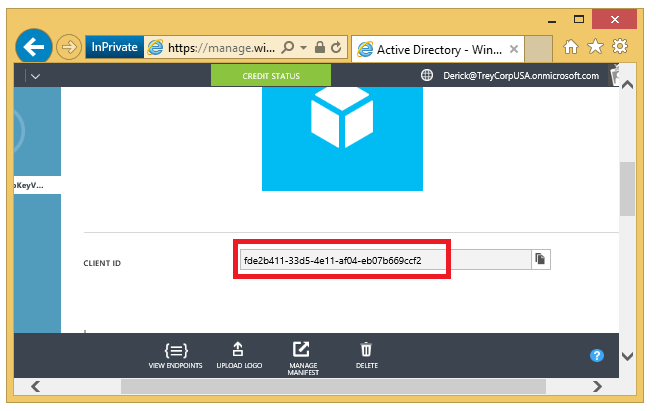

## Prepare for AKV Integration
To use Azure Key Vault Integration to configure your SQL Server VM, there are several prerequisites: 

1. [Install Azure Powershell](#install-azure-powershell)
2. [Create an Azure Active Directory](#create-an-azure-active-directory)
3. [Create a key vault](#create-a-key-vault)

The following sections describe these prerequisites and the information you need to collect to later run the PowerShell cmdlets.

### Install Azure PowerShell
Make sure you have installed the latest Azure PowerShell SDK. For more information, see [How to install and configure Azure PowerShell](/powershell/azureps-cmdlets-docs).

### Create an Azure Active Directory
First, you need to have an [Azure Active Directory](https://azure.microsoft.com/trial/get-started-active-directory/) (AAD) in your subscription. Among many benefits, this allows you to grant permission to your key vault for certain users and applications.

Next, register an application with AAD. This will give you a Service Principal account that has access to your key vault which your VM will need. In the Azure Key Vault article, you can find these steps in the [Register an application with Azure Active Directory](../articles/key-vault/key-vault-get-started.md#register) section, or you can see the steps with screen shots in the **Get an identity for the application section** of [this blog post](http://blogs.technet.com/b/kv/archive/2015/01/09/azure-key-vault-step-by-step.aspx). Before completing these steps, note that you need to collect the following information during this registration that is needed later when you enable Azure Key Vault Integration on your SQL VM.

* After the application is added, find the **CLIENT ID**  on the **CONFIGURE** tab. 
    
  
    The client ID is assigned later to the **$spName** (Service Principal name) parameter in the PowerShell script to enable Azure Key Vault Integration. 
* Also, during these steps when you create your key, copy the secret for your key as is shown in the following screenshot. This key secret is assigned later to the **$spSecret** (Service Principal secret) parameter in the PowerShell script.  
    
* You must authorize this new client ID to have the following access permissions: **encrypt**, **decrypt**, **wrapKey**, **unwrapKey**, **sign**, and **verify**. This is done with the [Set-AzureRmKeyVaultAccessPolicy](https://msdn.microsoft.com/library/azure/mt603625.aspx) cmdlet. For more information see [Authorize the application to use the key or secret](../articles/key-vault/key-vault-get-started.md#authorize).

### Create a key vault
In order to use Azure Key Vault to store the keys you will use for encryption in your VM, you need access to a key vault. If you have not already set up your key vault, create one by following the steps in the [Getting Started with Azure Key Vault](../articles/key-vault/key-vault-get-started.md) topic. Before completing these steps, note that there is some information you need to collect during this set up that is needed later when you enable Azure Key Vault Integration on your SQL VM.

When you get to the Create a key vault step, note the returned **vaultUri** property, which is the key vault URL. In the example provided in that step, shown below, the key vault name is ContosoKeyVault, therefore the key vault URL would be https://contosokeyvault.vault.azure.net/.

    New-AzureRmKeyVault -VaultName 'ContosoKeyVault' -ResourceGroupName 'ContosoResourceGroup' -Location 'East Asia'

The key vault URL is assigned later to the **$akvURL** parameter in the PowerShell script to enable Azure Key Vault Integration.

