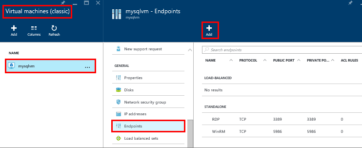

### Create a TCP endpoint for the virtual machine
In order to access SQL Server from the internet, the virtual machine must have an endpoint to listen for incoming TCP communication. This Azure configuration step, directs incoming TCP port traffic to a TCP port that is accessible to the virtual machine.

> [!NOTE]
> If you are connecting within the same cloud service or virtual network, you do not have to create a publicly accessible endpoint. In that case, you could continue to the next step. For more information, see [Connection Scenarios](../articles/virtual-machines/windows/sqlclassic/virtual-machines-windows-classic-sql-connect.md#connection-scenarios).
> 
> 

1. On the Azure Portal, select **Virtual machines (classic)**.
2. Then select you SQL Server virtual machine.
3. Select **Endpoints**, and then click the **Add** button at the top of the Endpoints blade.
   
    
4. On the **Add Endpoint** blade, provide a **Name** such as SQLEndpoint.
5. Select **TCP** for the **Protocol**.
6. For **Public port**, specify a port number such as **57500**.
7. For **Private port**, specify SQL Server's listening port, which defaults to **1433**.
8. Click **Ok** to create the endpoint.

