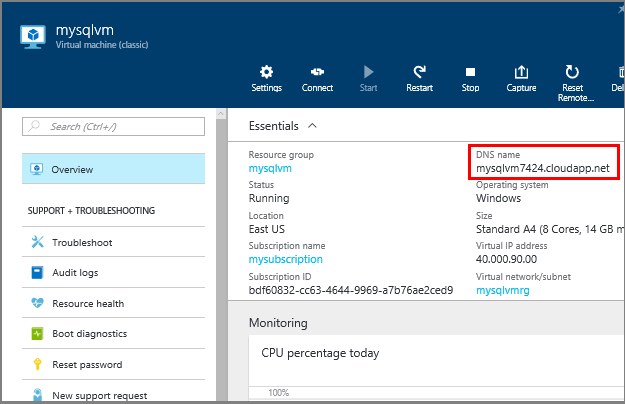
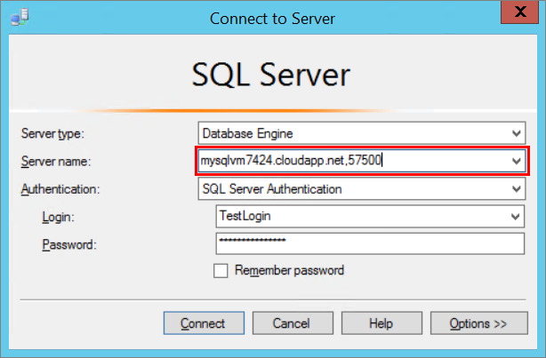
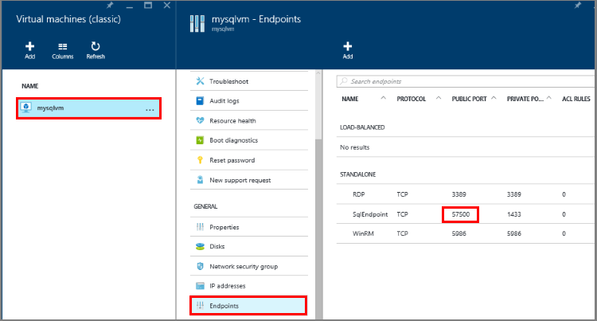

### Determine the DNS name of the virtual machine
To connect to the SQL Server Database Engine from another computer, you must know the Domain Name System (DNS) name of the virtual machine. (This is the name the internet uses to identify the virtual machine. You can use the IP address, but the IP address might change when Azure moves resources for redundancy or maintenance. The DNS name will be stable because it can be redirected to a new IP address.)  

1. In the Azure Portal (or from the previous step), select **Virtual machines (classic)**.
2. Select your SQL VM.
3. On the **Virtual machine** blade, copy the **DNS name** for the virtual machine.
   
    

### Connect to the Database Engine from another computer
1. On a computer connected to the internet, open SQL Server Management Studio.
2. In the **Connect to Server** or **Connect to Database Engine** dialog box, in the **Server name** box, enter the DNS name of the virtual machine (determined in the previous task) and a public endpoint port number in the format of *DNSName,portnumber* such as **mysqlvm.cloudapp.net,57500**.
   
    
   
    If you don't remember the public endpoint port number you previously created, you can find it in the **Endpoints** area of the **Virtual machine** blade.
   
    
3. In the **Authentication** box, select **SQL Server Authentication**.
4. In the **Login** box, type the name of a login that you created in an earlier task.
5. In the **Password** box, type the password of the login that you create in an earlier task.
6. Click **Connect**.

