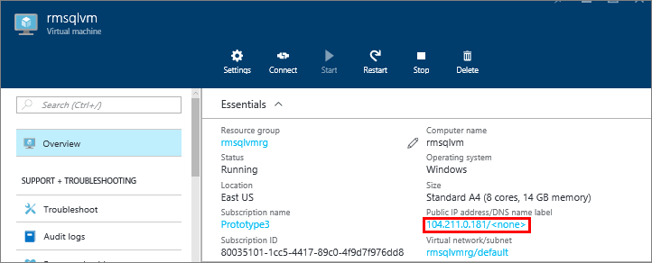
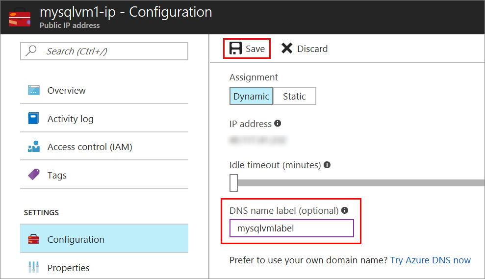
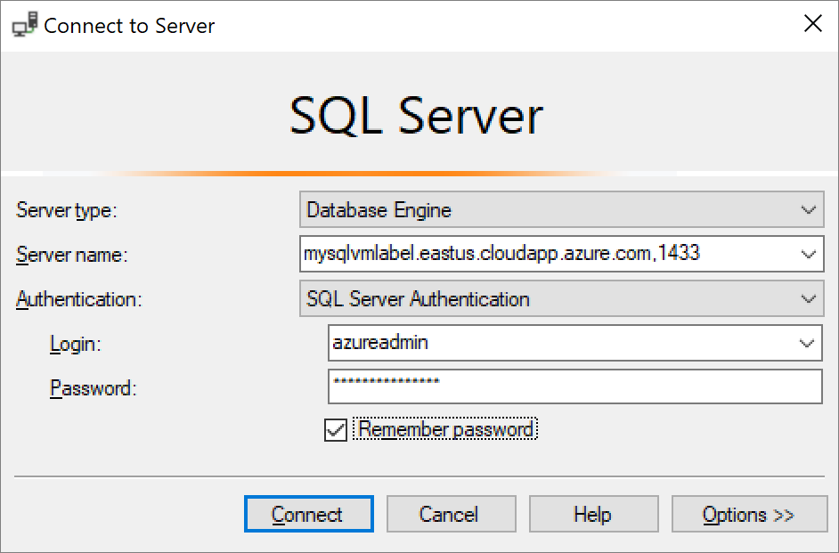

### Configure a DNS Label for the public IP address

To connect to the SQL Server Database Engine from the Internet, first configure a DNS Label for your public IP address.

> [AZURE.NOTE] DNS Labels are not required if you plan to only connect to the SQL Server instance within the same Virtual Network or only locally.

To create a DNS Label, first select **Virtual machines** in the portal. Select your SQL Server VM to bring up its properties.

1. In the virtual machine blade, select your **Public IP address.**

	

2. In the properties for your Public IP address, expand **Configuration**.

3. Enter a DNS Label name. This name is an A Record that can be used to connect to your SQL Server VM by name instead of by IP Address directly.

4. Click the **Save** button.

	

### Connect to the Database Engine from another computer

1. On a computer connected to the internet, open SQL Server Management Studio (SSMS).

2. In the **Connect to Server** or **Connect to Database Engine** dialog box, edit the **Server name** value. Enter the full DNS name of the virtual machine (determined in the previous task).

3. In the **Authentication** box, select **SQL Server Authentication**.

5. In the **Login** box, type the name of a valid SQL login.

6. In the **Password** box, type the password of the login.

7. Click **Connect**.

	
