The following steps demonstrate how to connect to the SQL Server instance over the internet using SQL Server Management Studio (SSMS). However, the same steps apply to making your SQL Server virtual machine accessible for your applications, running both on-premises and in Azure.

Before you can connect to the instance of SQL Server from another VM or the internet, you must complete the following tasks as described in the sections that follow:

- [Create a TCP endpoint for the virtual machine](#create-a-tcp-endpoint-for-the-virtual-machine)
- [Open TCP ports in the Windows firewall](#open-tcp-ports-in-the-windows-firewall-for-the-default-instance-of-the-database-engine)
- [Configure SQL Server to listen on the TCP protocol](#configure-sql-server-to-listen-on-the-tcp-protocol)
- [Configure SQL Server for mixed mode authentication](#configure-sql-server-for-mixed-mode-authentication)
- [Create SQL Server authentication logins](#create-sql-server-authentication-logins)
- [Determine the DNS name of the virtual machine](#determine-the-dns-name-of-the-virtual-machine)
- [Connect to the Database Engine from another computer](#connect-to-the-database-engine-from-another-computer)

The connection path is summarized by the following diagram:

### Create a TCP endpoint for the virtual machine

In order to access SQL Server from the internet, the virtual machine must have an endpoint to listen for incoming TCP communication. This Azure configuration step, directs incoming TCP port traffic to a TCP port that is accessible to the virtual machine.

>[AZURE.NOTE] If you are connecting within the same cloud service or virtual network, you do not have to create a publically accessible endpoint. In that case, you could continue to the next step. For more information, see [Connection Scenarios](../articles/virtual-machines/virtual-machines-sql-server-connectivity.md#connection-scenarios).

1. On the Azure Management Portal, click on **VIRTUAL MACHINES**.
	
2. Click on your newly created virtual machine. Information about your virtual machine is presented.
	
3. Near the top of the page, select the **ENDPOINTS** page, and then at the bottom of the page, click **ADD**.
	
4. On the **Add an Endpoint to a Virtual Machine** page, click **Add a Stand-alone Endpoint**, and then click the Next arrow to continue.
	
5. On the **Specify the details of the endpoint** page, provide the following information.

	- In the **NAME** box, provide a name for the endpoint.
	- In the **PROTOCOL** box, select **TCP**. You may type **57500** in the **PUBLIC PORT** box. Similarly, you may type SQL Server's default listening port **1433** in the **Private Port** box. Note that many organizations select different port numbers to avoid malicious security attacks. 

6. Click the check mark to continue. The endpoint is created.

### Open TCP ports in the Windows firewall for the default instance of the Database Engine

1. Connect to the virtual machine via Windows Remote Desktop. Once logged in, at the Start screen, type **WF.msc**, and then hit ENTER. 

	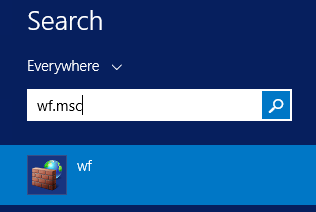
2. In the **Windows Firewall with Advanced Security**, in the left pane, right-click **Inbound Rules**, and then click **New Rule** in the action pane.

	

3. In the **New Inbount Rule Wizard** dialog box, under **Rule Type**, select **Port**, and then click **Next**.

4. In the **Protocol and Ports** dialog, use the default **TCP**. In the **Specific local ports** box, then type the port number of the instance of the Database Engine (**1433** for the default instance or your choice for the private port in the endpoint step). 

	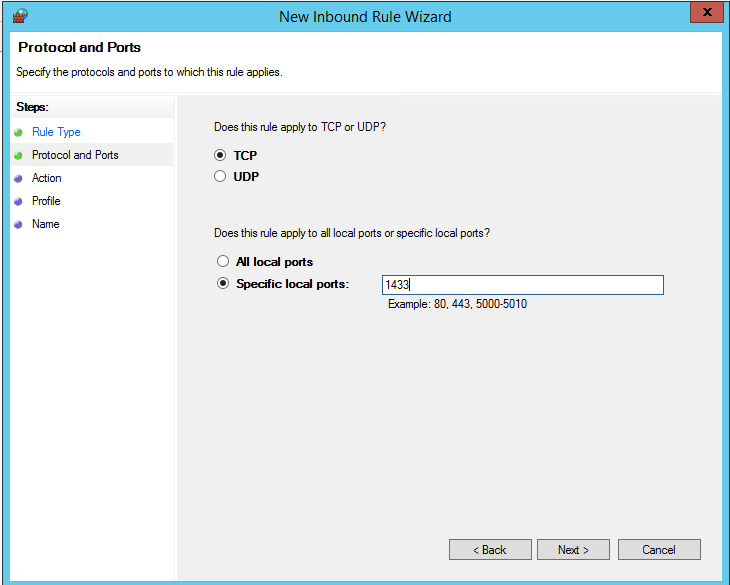

5. Click **Next**.

6. In the **Action** dialog box, select **Allow the connection**, and then click **Next**.

	**Security Note:** Selecting **Allow the connection if it is secure** can provide additional security. Select this option if you want to configure additional security options in your environment.

	

7. In the **Profile** dialog box, select **Public**, **Private**, and **Domain**. Then click **Next**. 

    **Security Note:**  Selecting **Public** allows access over the internet. Whenever possible, select a more restrictive profile.

	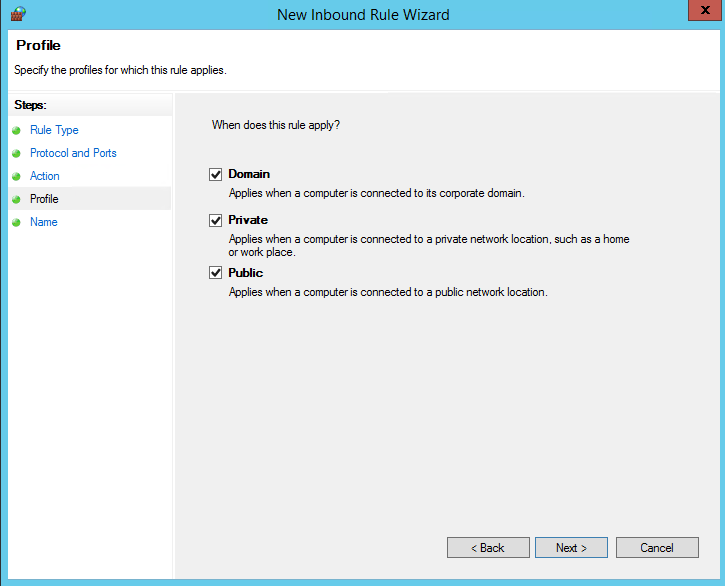

8. In the **Name** dialog box, type a name and description for this rule, and then click **Finish**.

	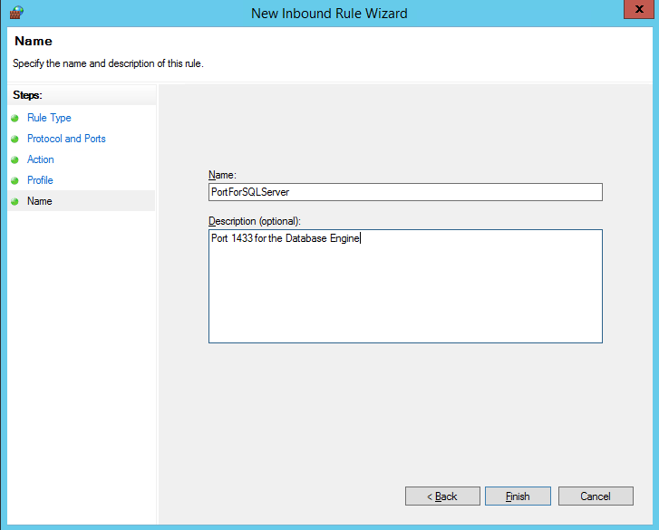

Open additional ports for other components as needed. For more information, see [Configuring the Windows Firewall to Allow SQL Server Access](http://msdn.microsoft.com/library/cc646023.aspx).

### Configure SQL Server to listen on the TCP protocol

1. While connected to the virtual machine, on the Start page, type **SQL Server Configuration Manager** and hit ENTER.
	
	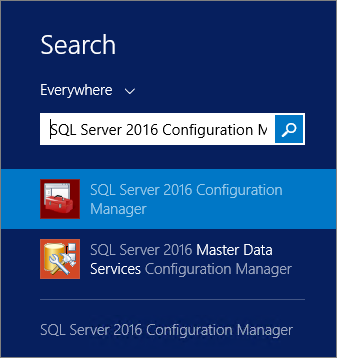

2. In SQL Server Configuration Manager, in the console pane, expand **SQL Server Network Configuration**.

3. In the console pane, click **Protocols for MSSQLSERVER** (he default instance name.) In the details pane, right-click TCP, it should be Enabled for the gallery images by default. For your custom images, click **Enable** (if its status is Disabled.)

	

5. In the console pane, click **SQL Server Services**. In the details pane, right-click **SQL Server (_instance name_)** (the default instance is **SQL Server (MSSQLSERVER)**), and then click **Restart**, to stop and restart the instance of SQL Server. 

	

7. Close SQL Server Configuration Manager.

For more information about enabling protocols for the SQL Server Database Engine, see [Enable or Disable a Server Network Protocol](http://msdn.microsoft.com/library/ms191294.aspx).

### Configure SQL Server for mixed mode authentication

The SQL Server Database Engine cannot use Windows Authentication without domain environment. To connect to the Database Engine from another computer, configure SQL Server for mixed mode authentication. Mixed mode authentication allows both SQL Server Authentication and Windows Authentication.

>[AZURE.NOTE] Configuring mixed mode authentication might not be necessary if you have configured an Azure Virtual Network with a configured domain environment.

1. While connected to the virtual machine, on the Start page, type **SQL Server 2014 Management Studio** and click the selected icon.

	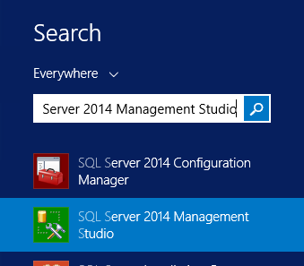

	The first time you open Management Studio it must create the users Management Studio environment. This may take a few moments.

2. Management Studio presents the **Connect to Server** dialog box. In the **Server name** box, type the name of the virtual machine to connect to the Database Engine  with the Object Explorer. (Instead of the virtual machine name you can also use **(local)** or a single period as the **Server name**. Select **Windows Authentication**, and leave **_your_VM_name_\your_local_administrator** in the **User name** box. Click **Connect**.

	

3. In SQL Server Management Studio Object Explorer, right-click the name of the instance of SQL Server (the virtual machine name), and then click **Properties**.

	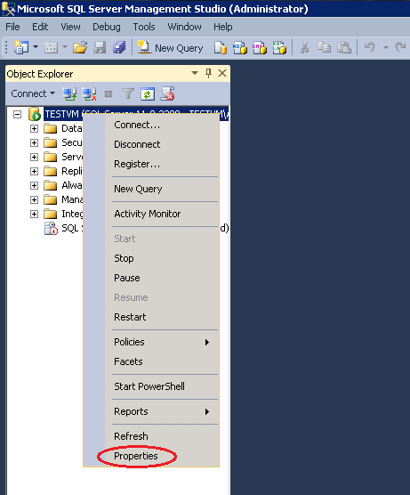

4. On the **Security** page, under **Server authentication**, select **SQL Server and Windows Authentication mode**, and then click **OK**.

	

5. In the SQL Server Management Studio dialog box, click **OK** to acknowledge the requirement to restart SQL Server.

6. In Object Explorer, right-click your server, and then click **Restart**. (If SQL Server Agent is running, it must also be restarted.)

	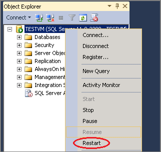

7. In the SQL Server Management Studio dialog box, click **Yes** to agree that you want to restart SQL Server.

### Create SQL Server authentication logins

To connect to the Database Engine from another computer, you must create at least one SQL Server authentication login.

1. In SQL Server Management Studio Object Explorer, expand the folder of the server instance in which you want to create the new login.

2. Right-click the **Security** folder, point to **New**, and select **Login...**.

	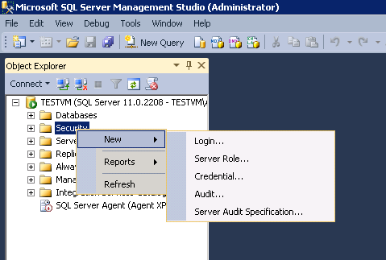

3. In the **Login - New** dialog box, on the **General** page, enter the name of the new user in the **Login name** box.

4. Select **SQL Server authentication**.

5. In the **Password** box, enter a password for the new user. Enter that password again into the **Confirm Password** box.

6. To enforce password policy options for complexity and enforcement, select **Enforce password policy** (recommended). This is a default option when SQL Server authentication is selected.

7. To enforce password policy options for expiration, select **Enforce password expiration** (recommended). Enforce password policy must be selected to enable this checkbox. This is a default option when SQL Server authentication is selected.

8. To force the user to create a new password after the first time the login is used, select **User must change password at next login** (Recommended if this login is for someone else to use. If the login is for your own use, do not select this option.) Enforce password expiration must be selected to enable this checkbox. This is a default option when SQL Server authentication is selected. 

9. From the **Default database** list, select a default database for the login. **master** is the default for this option. If you have not yet created a user database, leave this set to **master**.

10. In the **Default language** list, leave **default** as the value.
    
	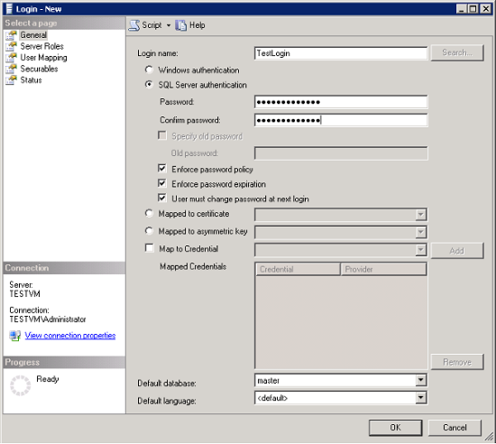

11. If this is the first login you are creating, you may want to designate this login as a SQL Server administrator. If so, on the **Server Roles** page, check **sysadmin**. 

	**Security Note:** Members of the sysadmin fixed server role have complete control of the Database Engine. You should carefully restrict membership in this role.

	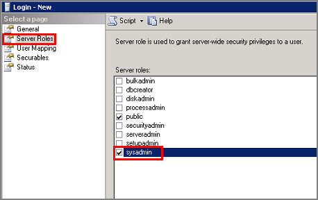

12. Click OK.

For more information about SQL Server logins, see [Create a Login](http://msdn.microsoft.com/library/aa337562.aspx).

### Determine the DNS name of the virtual machine

To connect to the SQL Server Database Engine from another computer, you must know the Domain Name System (DNS) name of the virtual machine. (This is the name the internet uses to identify the virtual machine. You can use the IP address, but the IP address might change when Azure moves resources for redundancy or maintenance. The DNS name will be stable because it can be redirected to a new IP address.)  

1. In the Azure Management Portal (or from the previous step), select **VIRTUAL MACHINES**. 

2. On the **VIRTUAL MACHINE INSTANCES** page, under the **Quick Glance** column, find and copy the DNS name for the virtual machine.

	
	

### Connect to the Database Engine from another computer
 
1. On a computer connected to the internet, open SQL Server Management Studio.
2. In the **Connect to Server** or **Connect to Database Engine** dialog box, in the**Server name** box, enter the DNS name of the virtual machine (determined in the previous task) and a public endpoint port number in the format of *DNSName,portnumber* such as **tutorialtestVM.cloudapp.net,57500**.
To get the port number, log in to the Azure Management Portal and find the Virtual Machine. On the Dashboard, click **ENDPOINTS** and use the **PUBLIC PORT** assigned to **MSSQL**.
	
3. In the **Authentication** box, select **SQL Server Authentication**.
5. In the **Login** box, type the name of a login that you created in an earlier task.
6. In the **Password** box, type the password of the login that you create in an earlier task.
7. Click **Connect**.

	
