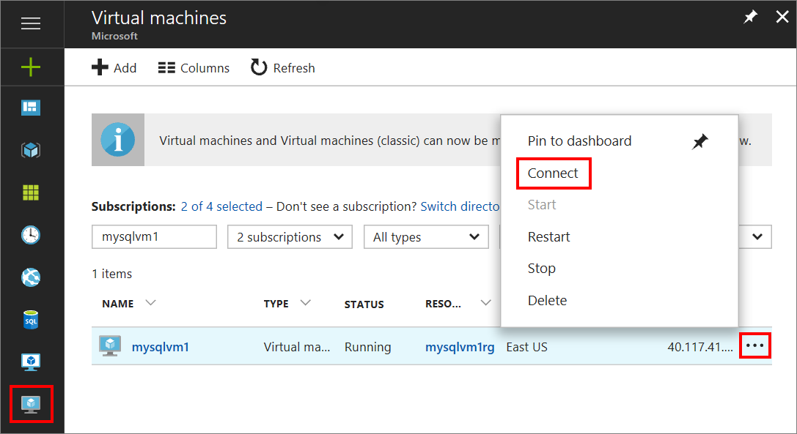
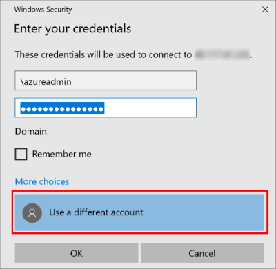

Use the following steps to connect to the SQL Server virtual machine with Remote Desktop:

1. After the Azure virtual machine is created and running, click the Virtual Machines icon in the Azure portal to view your VMs.

1. Click the ellipsis, **...**, for your new VM.

1. Click **Connect**.

   

1. Open the **RDP** file that your browser downloads for the VM.

1. The Remote Desktop Connection notifies you that the publisher of this remote connection cannot be identified. Click **Connect** to continue.

1. In the **Windows Security** dialog, click **Use a different account**. You might have to click **More choices** to see this. Specify the user name and password that you configured when you created the VM. You must add a backslash before the user name.

   

After you connect to the SQL Server virtual machine, you can launch SQL Server Management Studio and connect with Windows Authentication using your local administrator credentials. If you enabled SQL Server Authentication, you can also connect with SQL Authentication using the SQL login and password you configured during provisioning.

Access to the machine enables you to directly change machine and SQL Server settings based on your requirements. For example, you could configure the firewall settings or change SQL Server configuration settings.