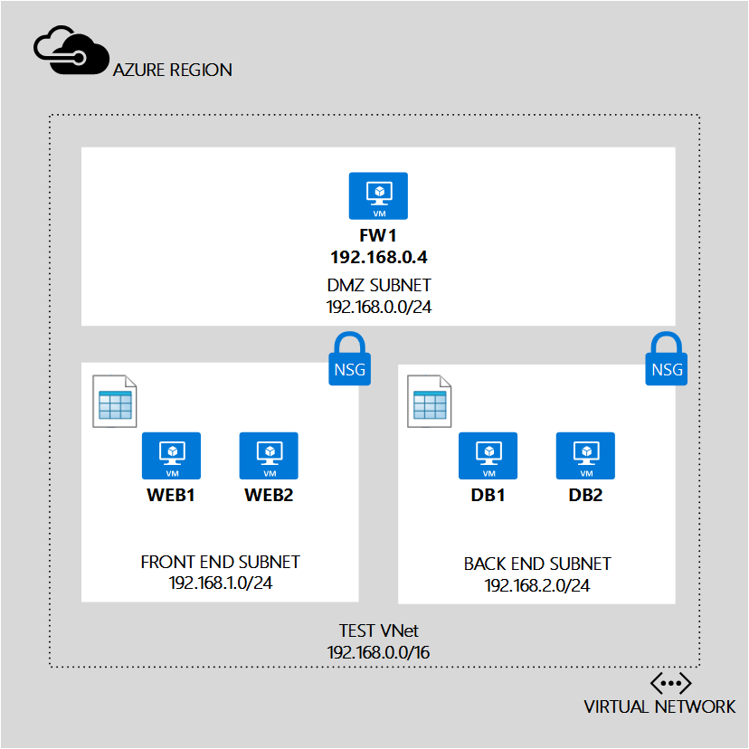

## Scenario
To better illustrate how to create UDRs, this document uses the following scenario:

In this scenario, you create one UDR for the *Front-end subnet* and another UDR for the *Back-end subnet*, as follows: 

* **UDR-FrontEnd**. The front-end UDR is applied to the *FrontEnd* subnet, and contain one route:    
  * **RouteToBackend**. This route sends all traffic to the back-end subnet to the **FW1** virtual machine.
* **UDR-BackEnd**. The back-end UDR is applied to the *BackEnd* subnet, and contain one route:    
  * **RouteToFrontend**. This route sends all traffic to the front-end subnet to the **FW1** virtual machine.

The combination of these routes ensures that all traffic destined from one subnet to another is routed to the **FW1** virtual machine, which is being used as a virtual appliance. You also need to turn on IP forwarding for the **FW1** VM, to ensure it can receive traffic destined to other VMs.

