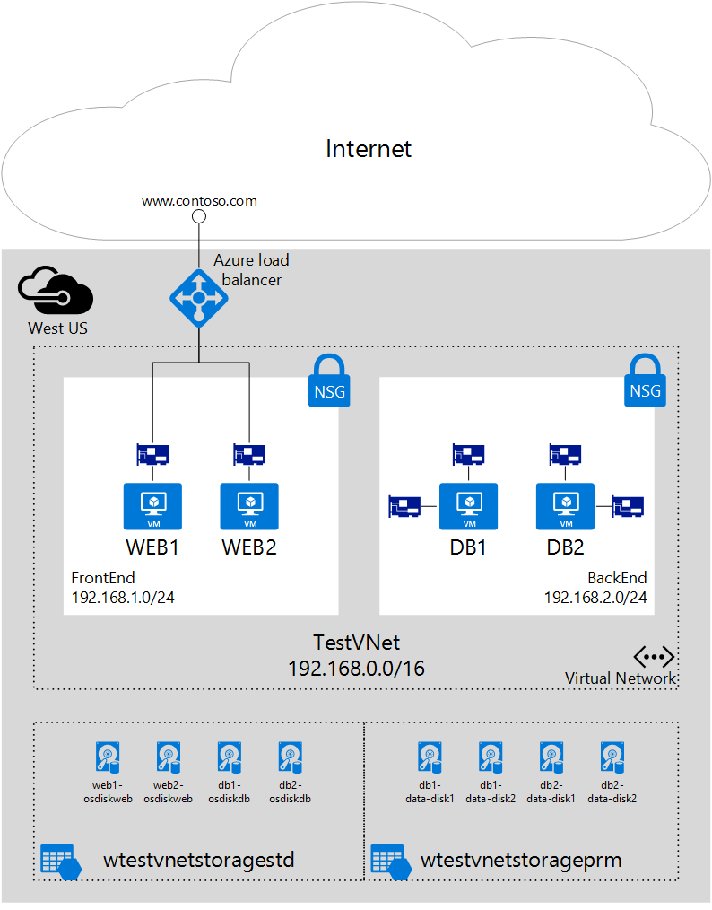

## Scenario
This document walks through a deployment that uses multiple NICs in VMs in a specific scenario. In this scenario, you have a two-tiered IaaS workload hosted in Azure. Each tier is deployed in its own subnet in a virtual network (VNet). The front-end tier is composed of several web servers, grouped together in a load balancer set for high availability. The back-end tier is composed of several database servers. The database servers are deployed with two NICs each, one for database access, the other for management. The scenario also includes Network Security Groups (NSGs) to control what traffic is allowed to each subnet, and NIC in the deployment. The following picture shows the basic architecture of this scenario:

