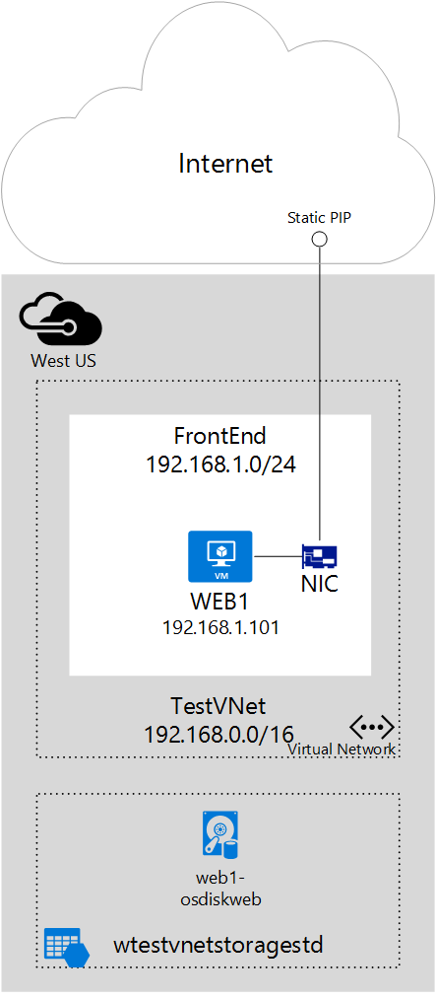

## Scenario

This document will walk through a deployment that uses a static public IP address allocated to a virtual machine (VM). In this scenario, you have a single VM with its own static public IP address. The VM is part of a subnet named **FrontEnd** and also has a static private IP address (**192.168.1.101**) in that subnet.

You may need a static IP address for web servers that require SSL connections in which the SSL certificate is linked to an IP address. 

You can follow the steps below to deploy the environment shown in the figure above.
