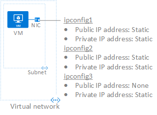

## Scenario
A VM with a single NIC is created and connected to a virtual network. The VM requires three different *private* IP addresses and two *public* IP addresses. The IP addresses are assigned to the following IP configurations:

* **IPConfig-1:** Assigns a *static* private IP address and a *static* public IP address.
* **IPConfig-2:** Assigns a *static* private IP address and a *static* public IP address.
* **IPConfig-3:** Assigns a *static* private IP address and no public IP address.
  
	

The IP configurations are associated to the NIC when the NIC is created and the NIC is attached to the VM when the VM is created. The types of IP addresses used for the scenario are for illustration. You can assign whatever IP address and assignment types you require.

> [!NOTE]
> Though the steps in this article assigns all IP configurations to a single NIC, you can also assign multiple IP configurations to any NIC in a multi-NIC VM. To learn how to create a VM with multiple NICs, read the [Create a VM with multiple NICs](../articles/virtual-machines/windows/multiple-nics.md) article.