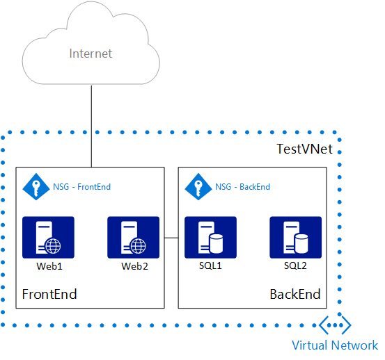

## Scenario
To better illustrate how to create NSGs, this document uses the following scenario:

In this scenario, you create an NSG for each subnet in the **TestVNet** virtual network, as follows: 

* **NSG-FrontEnd**. The front-end NSG is applied to the *FrontEnd* subnet, and contains two rules:    
  * **rdp-rule**. Allows RDP traffic to the *FrontEnd* subnet.
  * **web-rule**. Allows HTTP traffic to the *FrontEnd* subnet.
* **NSG-BackEnd**. The back-end NSG is applied to the *BackEnd* subnet, and contains two rules:    
  * **sql-rule**. Allows SQL traffic only from the *FrontEnd* subnet.
  * **web-rule**. Denies all internet bound traffic from the *BackEnd* subnet.

The combination of these rules create a DMZ-like scenario, where the back-end subnet can only receive incoming traffic for SQL from the front-end subnet, and has no access to the Internet, while the front-end subnet can communicate with the Internet, and receive incoming HTTP requests only.

