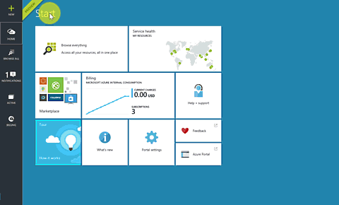
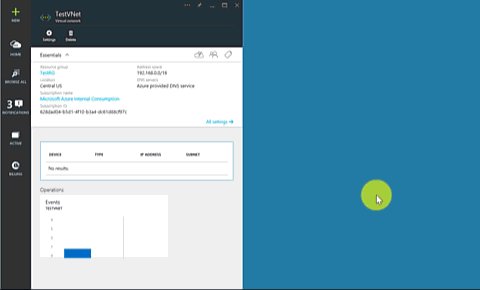
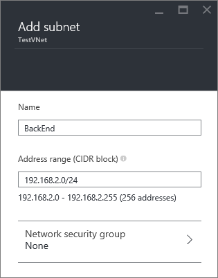
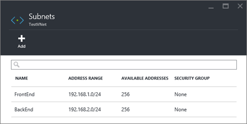

## How to create a VNet in the Azure preview portal

To create a VNet based on the scenario above by using the Azure preview portal, follow the steps below.

1. From a browser, navigate to http://portal.azure.com and, if necessary, sign in with your Azure account.
2. Click **NEW** > **Networking** > **Virtual network**, then click **Resource Manager** from the **Select a deployment model** list, and then click **Create**, as seen in the figure below.

	

3. On the **Create virtual network** blade, configure the VNet settings as shown in the figure below.

	

4. Click **Resource group** and select a resource group to add the VNet to, or click **Create new** to add the VNet to a new resource group. The figure below shows the resource group settings for a new resource group called **TestRG**. For more information about resource groups, visit [Azure Resource Manager Overview](resource-group-overview.md/#resource-groups).

	

5. If necessary, change the **Subscription** and **Location** settings for your VNet. 

6. If you do not want to see the VNet as a tile in the **Startboard**, disable **Pin to Startboard**. 

7. Click **Create** and notice the tile named **Creating Virtual network** as shown in the figure below.

	

8. Wait for the VNet to be created, then in the **Virtual network** blade, click **All settings** > **Subnets** > **Add** as seen below.

	

9. Specify the subnet settings for the *BackEnd* subnet, as shown below, and then click **OK**. 

	

10. Notice the list of subnets, as shown in the figure below.

	