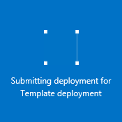

## Deploy the ARM template by using click to deploy

You can reuse pre-defined ARM templates upload to a github repository maintained by Microsoft and open to the community. THese templates can be deployed straight out of github, or downloaded and modified to fit your needs. To deploy a template that creates a VNet with two subnets, follow the steps below.

1. From a browser, navigate to [https://github.com/Azure/azure-quickstart-templates](https://github.com/Azure/azure-quickstart-templates).
2. Scroll down the list of templates, and click **101-two-subnets**. Check the **README.md** file, as shown below.

	

3. Click **Deploy to Azure**. If necessary, enter your Azure login credentials. 
4. In the **Parameters** blade, enter the values you want to use to create your new VNet, and then click **OK**. The figure below shows the values for our scenario.

	

4. Click **Resource group** and select a resource group to add the VNet to, or click **Create new** to add the VNet to a new resource group. To learn more about resource groups, see . The figure below shows the resource group settings for a new resource group called **TestRG**.

	

5. If necessary, change the **Subscription** and **Location** settings for your VNet.
6. If you do not want to see the VNet as a tile in the **Startboard**, disable **Pin to Startboard**.
5. Click **Leagl terms**, read the terms, and click **Buy** to agree. 
6. Click **Create** to create the VNet.

	

7. Once the deployment is done, click **TestVNet** > **All settings** > **Subnets** to see the subnet properties, as shown below.

	