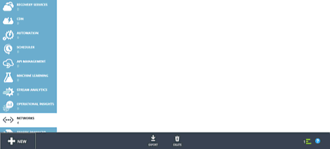
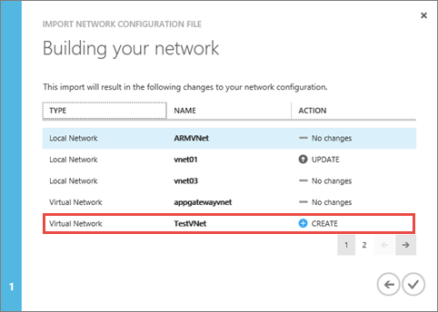

## How to create a VNet using a network config file in the Azure portal

Azure uses an xml file to define all VNets available to a subscription. You can download this file, and edit it to modify or delete existing VNets, and create new ones. In this document, you will learn how to download this file, referred to as network configuration (or netcgf) file, and edit it to create a new VNet. Check the [Azure virtual network configuration schema](https://msdn.microsoft.com/library/azure/jj157100.aspx) to learn more about the network configuration file.

To create a VNet using a netcfg file through the Azure portal, follow the steps below.

1. From a browser, navigate to http://manage.windowsazure.com and, if necessary, sign in with your Azure account.
2. Scroll down on the list of services, and click on **NETWORKS** as seen below.

	

3. On the bottom of the page, click the **EXPORT** button, as shown below.

	

4. On the **Export network configuration** page, select the subscription you want to export the virtual network configuration from, and then click the check mark button on the bottom left hand corner of the page.
5. Follow your browser instructions to save the **NetworkConfig.xml** file. Make sure you note where you are saving the file.
6. Open the file you saved in step 5 above using any XML or text editor application, and look for the **<VirtualNetworkSites>** element. If you have any networks already created, each network will be displayed as its own **<VirtualNetworkSite>** element.
7. To create the virtual network described in this scenario, add the following XML just under the **<VirtualNetworkSites>** element:

		<VirtualNetworkSite name="TestVNet" Location="Central US">
		  <AddressSpace>
		    <AddressPrefix>192.168.0.0/16</AddressPrefix>
		  </AddressSpace>
		  <Subnets>
		    <Subnet name="FrontEnd">
		      <AddressPrefix>192.168.1.0/24</AddressPrefix>
		    </Subnet>
		    <Subnet name="BackEnd">
		      <AddressPrefix>192.168.2.0/24</AddressPrefix>
		    </Subnet>
		  </Subnets>
		</VirtualNetworkSite>

8.  Save the network configuration file.
9.  In the Azure portal, on the bottom left hand corner of the page, click **NEW**, then click **NETWORK SERVICES**, then click **VIRTUAL NETWORK**, and then click **IMPORT CONFIGURATION** as shown in the figure below.

	

10.  On the **Import the network configuration file** page, click **BROWSE FOR FILE...**, then navigate to the folder you saved your file in step 8 above, select the file, and then click **Open**. The web page should look similar to the figure below. On the bottom right hand corner of the page, click on the arrow button to move to the next step.

	

11.   On the **Building your network** page, notice the entry for your new VNet, as shown in the figure below.

	

12.   Click on the check mark button on the bottom right hand corner of the page to create the VNet. After a few seconds your VNet will be shown in the list of available VNets, as shown in the figure below.

	