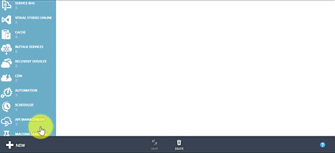
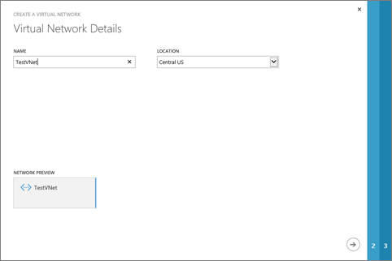
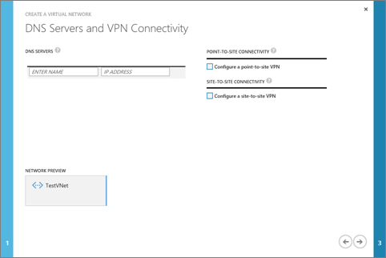
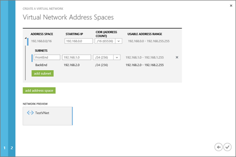

## How to create a VNet in the Azure portal

To create a VNet based on the scenario above, follow the steps below.

1. From a browser, navigate to http://manage.windowsazure.com and, if necessary, sign in with your Azure account.
2. Click **NEW** > **NETWORK SERVICES** > **VIRTUAL NETWORK** > **CUSTOM CREATE** as shown in the figure below.

	

3. On the **Virtual Network Details** page, type the **NAME** of the VNet, select its **LOCATION**, and then click on the arrow on the bottom right hand corner of the page to advance to step 2. The figure below shows the settings for our scenario.

	

4. On the **DNS Servers and VPN Connectivity** page, specify the name and IP address for up to 9 DNS servers to use. If you do not specify a DNS server, your VNet will use the internal naming resolution resolution provided by Azure. For our scenario, we will not configure DNS servers.
5. If you want to provide point-to-site VPN access to your VNet, enable the **Configure a point-to-site VPN** checkbox. If you do not configure a point-to-site VPN, you can add it to your VNet at any time after creation. For our scenario, we will not configure a point-to-site VPN.
6. If you want to provide site-to-site VPN connectivity between your VNet and another VNet or your on-premises network, enable the **Configure a site-to-site VPN** checkbox and specify if you want to use **ExpressRoute** or note, and the name of the network to connect to. If you do not configure a site-to-site VPN, you can add it to your VNet at any time after creation. For our scenario, we will not configure a site-to-site VPN.
7. Click on the arrow on the bottom right hand corner of the page to advance to step 3.The figure below shows the settings for our scenario.

	

8. On the **Virtual Network Address Spaces** page, under **STARTING IP**, click on *10.0.0.0* to change the VNet address space, and then type the starting address space you want to use. For our scenario, type *192.168.0.0*. 
9. Under **CIDR (ADDRESS COUNT)** select the number of bits for the subnet mask. For our scenario, select *16 (65536)*.
10. Under **SUBNETS**, click *Subnet-1* and rename the subnet if necessary. For our scenario, rename it to *FrontEnd*.

	>[AZURE.NOTE] If you click outside the name textbox for a subnet you will not be able to edit the name if the subnet again. To fix that, you need to remove the subnet by clicking on the X button to its right, then add a new subnet as described in step 13 below.

11. Under **STARTING IP** for the first subnet, specify the starting IP address for the subnet. For our scenario, type *192.168.1.0*.
12. Under **CIDR (ADDRESS COUNT)** select the number of bits for the subnet mask for the first subnet. For our scenario, select *24 (256)*.
13. Click **add subnet** to add a new subnet, if necessary. For our scenario, add a subnet and repeat steps 10 to 12 to configure the VNet as shown in the figure below.

	

14. Click on the check mark button on the bottom right hand corner of the page to create the VNet. After a few seconds your VNet will be shown in the list of available VNets, as shown in the figure below.

	