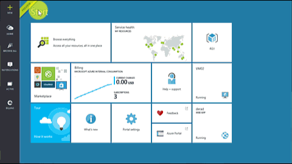
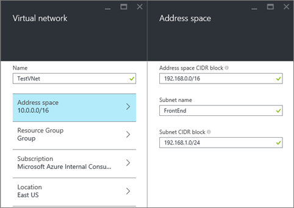
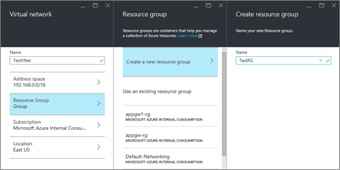
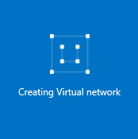
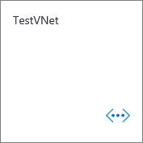
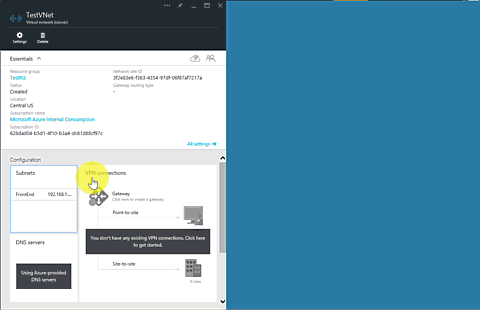

## How to create a classic VNet in the Azure preview portal

To create a classic VNet based on the scenario above, follow the steps below.

1. From a browser, navigate to http://portal.azure.com and, if necessary, sign in with your Azure account.
2. Click **NEW** > **Networking** > **Virtual network**, notice that the **Select a deployment model** list already shows **Classic**, and then click **Create**, as seen in the figure below.

	

3. On the **Virtual network** blade, type the **Name** of the VNet, and then click **Address space**. Configure your address space settings for the VNet and its first subnet, then click **OK**. The figure below shows the CIDR block settings for our scenario.

	

4. Click **Resource Group** and select a resource group to add the VNet to, or click **Create new resource group** to add the VNet to a new resource group. The figure below shows the resource group settings for a new resource group called **TestRG**. For more information about resource groups, visit [Azure Resource Manager Overview](resource-group-overview.md/#resource-groups).

	

5. If necessary, change the **Subscription** and **Location** settings for your VNet. 

6. If you do not want to see the VNet as a tile in the **Startboard**, disable **Pin to Startboard**. 

7. Click **Create** and notice the tile named **Creating Virtual network** as shown in the figure below.

	

8. Wait for the VNet to be created, and when you see the tile below, click it to add more subnets.

	

9. You should see the **Configuration** for your VNet as shown below. 

	

10. Click **Subnets** > **Add**, then type a **Name** and specify an **Address range (CIDR block)** for your subnet, and then click **OK**. The figure below shows the settings for our current scenario.

	