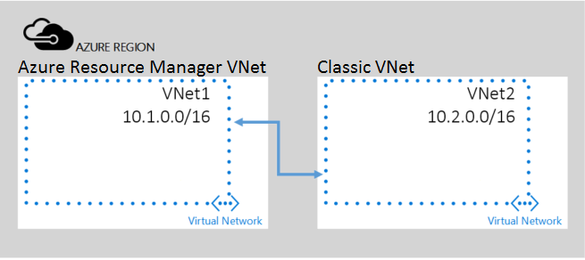

## Peering virtual networks from different deployment models 

In this scenario, you will create a peering between two VNets, namely **VNET1** and **VNET2** belonging to Azure Resource Manager deployment model and classic deployment model respectively.

