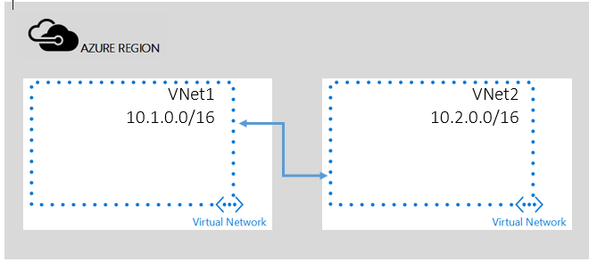

## Peering VNets in the same subscription

In this scenario you will create a peering between two VNets named **VNet1** and **VNet2** belonging to the same subscription. 

VNet peering will allow full connectivity between the entire address space of peered virtual networks.    