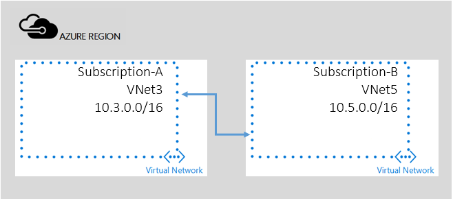

## Peering across subscriptions
In this scenario you will create a peering between two VNets that exist in different subscriptions.

VNet peering relies on role-based access control (RBAC) for authorization. For cross-subscriptions scenario, you first need to grant sufficient permission to users who will create the peering link.

> [!NOTE]
> If the same user has the privilege over both subscriptions, then you can skip steps 1-4 that follow.
> 
> 

