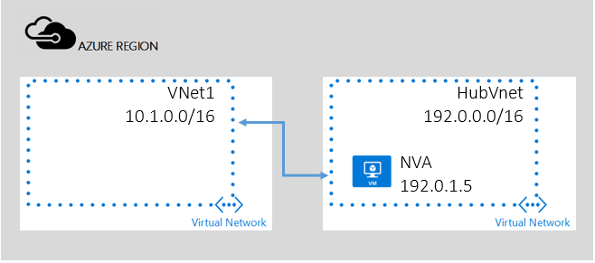

## Service Chaining - Transit through peered VNet

Although the use of system routes facilitates traffic automatically for your deployment, there are cases in which you want to control the routing of packets through a virtual appliance.
In this scenario, there are two VNets in a subscription, HubVNet and VNet1 as described in below diagram. You deploy Network Virtual Appliance(NVA) in VNet HubVNet. After establishing VNet peering between HubVNet and VNet1, you can set up User Defined Routes and specify the next hop to NVA in the HubVNet.

NOTE: For the simplicity, assume all VNets here are in the same subscription. But it also works for cross-subscription scenario. 

The key property to enable Transit routing is the "Allow Forwarded Traffic" parameter. This allows accepting and sending trafic from/to the NVA in the peered VNet.  