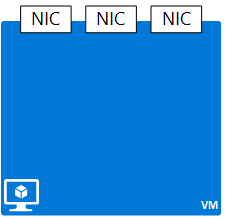

## NIC
 
A network interface card (NIC) resource provides network connectivity to an existing subnet in a VNet resource. Although you can create a NIC as a stand alone object, you need to associate it to another object to actually provide connectivity. A NIC can be used to connect a VM to a subnet, a public IP address, or a load balancer.  

|Property|Description|Sample values|
|---|---|---|
|**virtualMachine**|VM the NIC is associated with.|/subscriptions/{guid}/../Microsoft.Compute/virtualMachines/vm1|
|**macAddress**|MAC address for the NIC|any value between 4 and 30|
|**networkSecurityGroup**|NSG associated to the NIC|/subscriptions/{guid}/../Microsoft.Network/networkSecurityGroups/myNSG1|
|**dnsSettings**|DNS settings for the NIC.|see [PIP](#Public-IP-address).|

A Network Interface Card, or NIC, represents a network interface that can be associated to a virtual machine (VM). A VM can have one or more NICs.

### IP configurations
NICs have a child object named **ipConfigurations** containing the following properties:

|Property|Description|Sample values|
|---|---|---|
|**subnet**|Subnet the NIC is onnected to.|/subscriptions/{guid}/../Microsoft.Network/virtualNetworks/myvnet1/subnets/mysub1|
|**privateIPAddress**|IP address for the NIC in the subnet|10.0.0.8|
|**privateIPAllocationMethod**|IP allocation method|Dynamic or Static|
|**enableIPForwarding**|Whether the NIC can be used for routing|true or false|
|**primary**|Whether the NIC is the primary NIC for the VM|true or false|
|**publicIPAddress**|PIP associated with the NIC|see [DNS Settings](#DNS-settings)|
|**loadBalancerBackendAddressPools**|Back end address pools the NIC is associated with||
|**loadBalancerInboundNatRules**|Inbound load balancer NAT rules the NIC is associated with||

Sample public IP address in JSON format:

	{
	    "name": "lb-nic1-be",
	    "id": "/subscriptions/XXXXXXXX-XXXX-XXXX-XXXX-XXXXXXXXXXXX/resourceGroups/nrprg/providers/Microsoft.Network/networkInterfaces/lb-nic1-be",
	    "etag": "W/\"0027f1a2-3ac8-49de-b5d5-fd46550500b1\"",
	    "type": "Microsoft.Network/networkInterfaces",
	    "location": "eastus",
	    "properties": {
	        "provisioningState": "Succeeded",
	        "resourceGuid": "e80fdad0-f0da-44ab-816a-828c9ac3c20e",
	        "ipConfigurations": [
	            {
	                "name": "NIC-config",
	                "id": "/subscriptions/628dad04-b5d1-4f10-b3a4-dc61d88cf97c/resourceGroups/nrprg/providers/Microsoft.Network/networkInterfaces/lb-nic1-be/ipConfigurations/NIC-config",
	                "etag": "W/\"0027f1a2-3ac8-49de-b5d5-fd46550500b1\"",
	                "properties": {
	                    "provisioningState": "Succeeded",
	                    "privateIPAddress": "10.0.0.4",
	                    "privateIPAllocationMethod": "Dynamic",
	                    "subnet": {
	                        "id": "/subscriptions/628dad04-b5d1-4f10-b3a4-dc61d88cf97c/resourceGroups/NRPRG/providers/Microsoft.Network/virtualNetworks/NRPVnet/subnets/NRPVnetSubnet"
	                    },
	                    "loadBalancerBackendAddressPools": [
	                        {
	                            "id": "/subscriptions/628dad04-b5d1-4f10-b3a4-dc61d88cf97c/resourceGroups/nrprg/providers/Microsoft.Network/loadBalancers/nrplb/backendAddressPools/NRPbackendpool"
	                        }
	                    ],
	                    "loadBalancerInboundNatRules": [
	                        {
	                            "id": "/subscriptions/628dad04-b5d1-4f10-b3a4-dc61d88cf97c/resourceGroups/nrprg/providers/Microsoft.Network/loadBalancers/nrplb/inboundNatRules/rdp1"
	                        }
	                    ]
	                }
	            }
	        ],
	        "dnsSettings": {
	            "dnsServers": [],
	            "appliedDnsServers": []
	        },
	        "macAddress": "00-0D-3A-10-F1-29",
	        "enableIPForwarding": false,
	        "primary": true,
	        "virtualMachine": {
	            "id": "/subscriptions/628dad04-b5d1-4f10-b3a4-dc61d88cf97c/resourceGroups/nrprg/providers/Microsoft.Compute/virtualMachines/web1"
	        }
	    }
	}

### Additional resources

- Read the [REST API reference documentation](https://msdn.microsoft.com/library/azure/mt163579.aspx) for NICs.