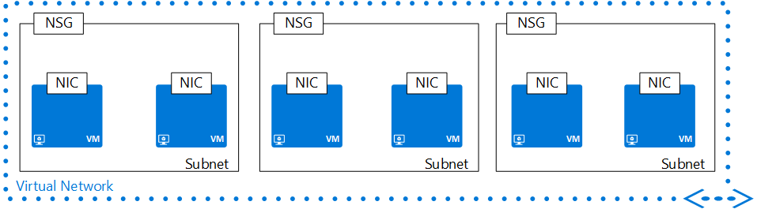

## Virtual Network
Virtual Networks (VNET) and subnets resources help define a security boundary for workloads running in Azure. A VNet is characterized by a collection of address spaces, defined as CIDR blocks. 

>[AZURE.NOTE] Network administrators are familiar with CIDR notation. If you are not familiar with CIDR, [learn more about it](http://whatismyipaddress.com/cidr).

VNets contain the following properties.

|Property|Description|Sample values|
|---|---|---|
|**addressSpace**|Collection of address prefixes that make up the VNet in CIDR notation|192.168.0.0/16|
|**subnets**|Collection of subnets that make up the VNet|see [subnets](#Subnets) below.|
|**ipAddress**|IP address assigned to object. This is a read-only property.|104.42.233.77|

### Subnets
A subnet is a child resource of a VNet, and helps define segments of address spaces within a CIDR block, using IP address prefixes. NICs can be added to subnets, and connected to VMs, providing connectivity for various workloads.

Subnets contain the following properties. 

|Property|Description|Sample values|
|---|---|---|
|**addressPrefix**|Single address prefix that make up the subnet in CIDR notation|192.168.1.0/24|
|**networkSecurityGroup**|NSG applied to the subnet|see [NSGs](#Network-Security-Group)|
|**routeTable**|Route table applied to the subnet|see [UDR](#Route-table)|
|**ipConfigurations**|Collection of IP configruation objects used by NICs connected to the subnet|see [UDR](#Route-table)|

Sample VNet in JSON format:

	{
	    "name": "TestVNet",
	    "id": "/subscriptions/xxxxxxxx-xxxx-xxxx-xxxx-xxxxxxxxxxxx/resourceGroups/TestRG/providers/Microsoft.Network/virtualNetworks/TestVNet",
	    "etag": "W/\"df04b001-d06c-4ef2-bc55-afeb5e5fb6ee\"",
	    "type": "Microsoft.Network/virtualNetworks",
	    "location": "westus",
	    "tags": {
	        "displayName": "VNet"
	    },
	    "properties": {
	        "provisioningState": "Succeeded",
	        "resourceGuid": "e9264495-a45a-4405-8374-d8e99a92a38e",
	        "addressSpace": {
	            "addressPrefixes": [
	                "192.168.0.0/16"
	            ]
	        },
	        "subnets": [
	            {
	                "name": "DMZ",
	                "id": "/subscriptions/xxxxxxxx-xxxx-xxxx-xxxx-xxxxxxxxxxxx/resourceGroups/TestRG/providers/Microsoft.Network/virtualNetworks/TestVNet/subnets/DMZ",
	                "etag": "W/\"df04b001-d06c-4ef2-bc55-afeb5e5fb6ee\"",
	                "properties": {
	                    "provisioningState": "Succeeded",
	                    "addressPrefix": "192.168.0.0/24",
	                    "ipConfigurations": [
	                        {
	                            "id": "/subscriptions/xxxxxxxx-xxxx-xxxx-xxxx-xxxxxxxxxxxx/resourceGroups/TestRG/providers/Microsoft.Network/networkInterfaces/NICFW1/ipConfigurations/ipconfig1"
	                        }
	                    ]
	                }
	            },
	            {
	                "name": "FrontEnd",
	                "id": "/subscriptions/xxxxxxxx-xxxx-xxxx-xxxx-xxxxxxxxxxxx/resourceGroups/TestRG/providers/Microsoft.Network/virtualNetworks/TestVNet/subnets/FrontEnd",
	                "etag": "W/\"df04b001-d06c-4ef2-bc55-afeb5e5fb6ee\"",
	                "properties": {
	                    "provisioningState": "Succeeded",
	                    "addressPrefix": "192.168.1.0/24",
	                    "networkSecurityGroup": {
	                        "id": "/subscriptions/xxxxxxxx-xxxx-xxxx-xxxx-xxxxxxxxxxxx/resourceGroups/TestRG/providers/Microsoft.Network/networkSecurityGroups/NSG-BackEnd"
	                    },
	                    "routeTable": {
	                        "id": "/subscriptions/xxxxxxxx-xxxx-xxxx-xxxx-xxxxxxxxxxxx/resourceGroups/TestRG/providers/Microsoft.Network/routeTables/UDR-FrontEnd"
	                    },
	                    "ipConfigurations": [
	                        {
	                            "id": "/subscriptions/xxxxxxxx-xxxx-xxxx-xxxx-xxxxxxxxxxxx/resourceGroups/TestRG/providers/Microsoft.Network/networkInterfaces/NICWEB1/ipConfigurations/ipconfig1"
	                        },
	                        {
	                            "id": "/subscriptions/xxxxxxxx-xxxx-xxxx-xxxx-xxxxxxxxxxxx/resourceGroups/TestRG/providers/Microsoft.Network/networkInterfaces/NICWEB2/ipConfigurations/ipconfig1"
	                        }
	                    ]
	                }
	            },
	            {
	                "name": "BackEnd",
	                "id": "/subscriptions/xxxxxxxx-xxxx-xxxx-xxxx-xxxxxxxxxxxx/resourceGroups/TestRG/providers/Microsoft.Network/virtualNetworks/TestVNet/subnets/BackEnd",
	                "etag": "W/\"df04b001-d06c-4ef2-bc55-afeb5e5fb6ee\"",
	                "properties": {
	                    "provisioningState": "Succeeded",
	                    "addressPrefix": "192.168.2.0/24",
	                    "networkSecurityGroup": {
	                        "id": "/subscriptions/xxxxxxxx-xxxx-xxxx-xxxx-xxxxxxxxxxxx/resourceGroups/TestRG/providers/Microsoft.Network/networkSecurityGroups/NSG-FrontEnd"
	                    },
	                    "routeTable": {
	                        "id": "/subscriptions/xxxxxxxx-xxxx-xxxx-xxxx-xxxxxxxxxxxx/resourceGroups/TestRG/providers/Microsoft.Network/routeTables/UDR-BackEnd"
	                    },
	                    "ipConfigurations": [
	                        {
	                            "id": "/subscriptions/xxxxxxxx-xxxx-xxxx-xxxx-xxxxxxxxxxxx/resourceGroups/TestRG/providers/Microsoft.Network/networkInterfaces/NICSQL2/ipConfigurations/ipconfig1"
	                        },
	                        {
	                            "id": "/subscriptions/xxxxxxxx-xxxx-xxxx-xxxx-xxxxxxxxxxxx/resourceGroups/TestRG/providers/Microsoft.Network/networkInterfaces/NICSQL1/ipConfigurations/ipconfig1"
	                        }
	                    ]
	                }
	            }
	        ]
	    }
	}

### Additional resources

- Get more information about [VNet](virtual-networks-overview.md).
- Read the [REST API reference documentation](https://msdn.microsoft.com/library/azure/mt163650.aspx) for VNets.
- Read the [REST API reference documentation](https://msdn.microsoft.com/library/azure/mt163618.aspx) for Subnets.