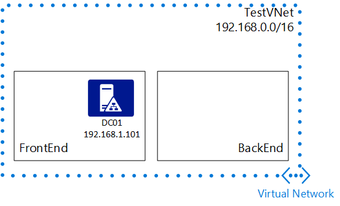

## Scenario

To better illustrate how to configure a static IP address for a VM, this document uses this scenario:

In this scenario, you create a VM named *DNS01* in the *FrontEnd* subnet, and then set it to use a static IP address of *192.168.1.101*.
