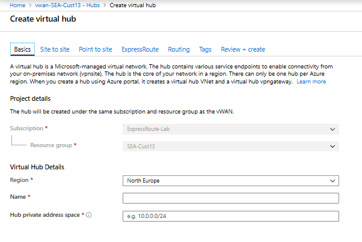
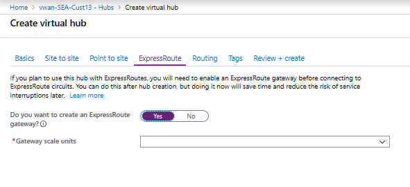

1. Locate the Virtual WAN that you created. On the Virtual WAN page, under the **Connectivity** section, select **Hubs**.
2. On the Hubs page, select **+New Hub** to open the **Create virtual hub** page.
3. On the **Create virtual hub** page **Basics** tab, complete the following fields:

   

    **Project details**

   * Region (previously referred to as Location)
   * Name
   * Hub private address space. The minimum address space is /24 to create a hub, which implies anything range from /25 to /32 will produce an error during creation.
4. Select the **ExpressRoute tab**.

5. On the **ExpressRoute** tab, complete the following fields:

   

   * Select **Yes** to create an **ExpressRoute** gateway.
   * Select the **Gateway scale units** value from the dropdown.
6. Select **Review + Create** to validate.
7. Select **Create** to create the hub. After 30 minutes, **Refresh** to view the hub on the **Hubs** page. Select **Go to resource** to navigate to the resource.