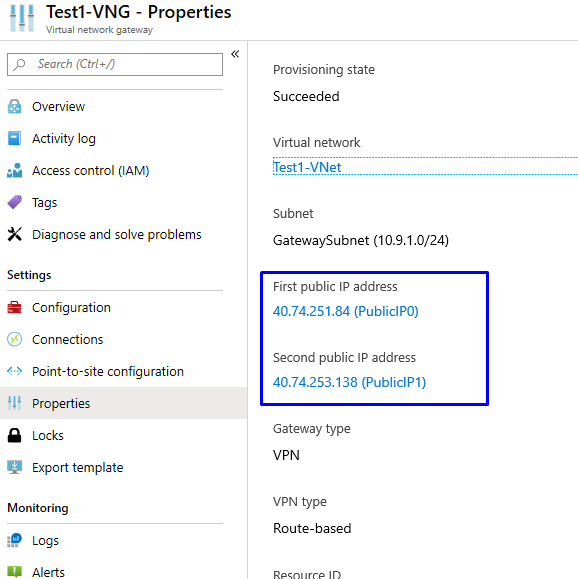
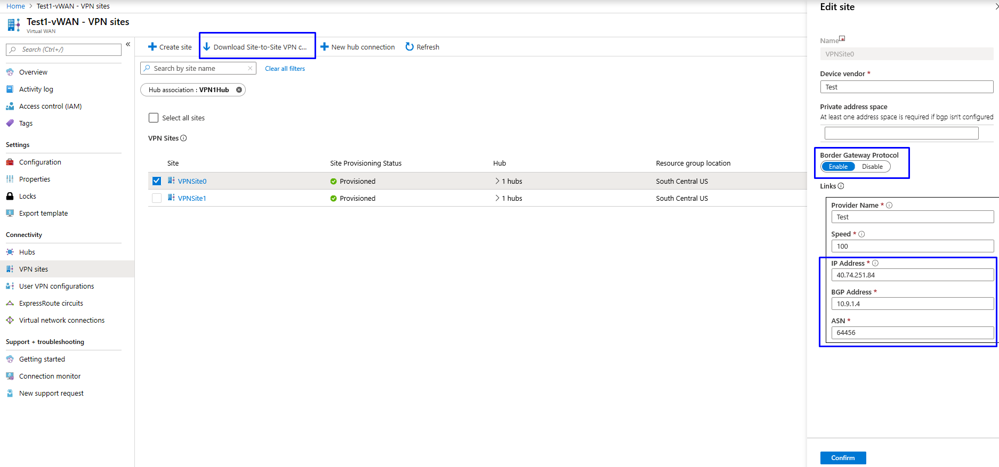
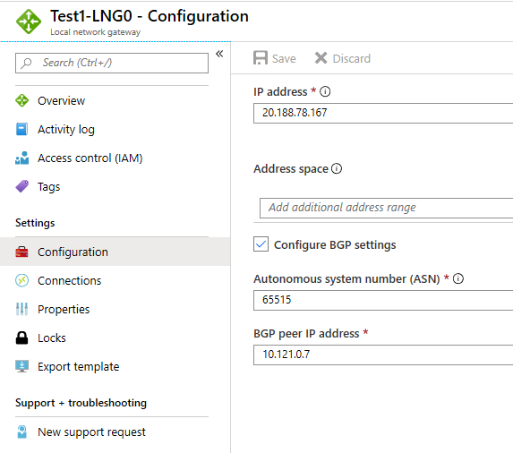
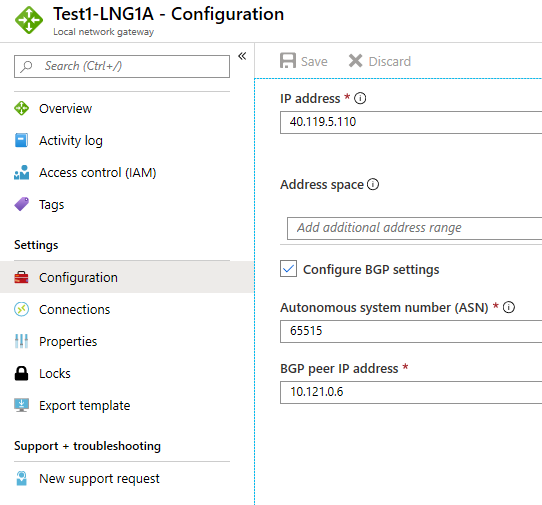

Creating a connection from the Azure virtual network gateway VPN to a virtual WAN is very similar to setting up connectivity to a virtual WAN from branch VPN sites. In order to setup this connectivity, you need to take care of two things:

1. Create two VPN sites for your virtual WAN which represent active-active instances of Azure virtual network gateway VPN.
2. Create two local network gateways and connect these to the Azure virtual network gateway VPN. The local network gateways need to have same settings as the VPN gateway instances of Virtual WAN. You can find these settings on the VPN Sites page for your virtual WAN. To download the settings, select **Download Site-to-Site VPN configuration**.

If you want to set up connectivity over BGP, you’ll need to select the **Enable BGP** option and provide the BGP ASN and BGP peer IP addresses during the setup. The BGP ASN for local network gateways is 65515 (the same settings as VPN gateway instances of virtual WAN). For Azure virtual network gateway VPN, the BGP ASN is a value other than 65515 (same settings as VPN sites of the virtual WAN).

### Virtual network gateway VPN settings

### Virtual WAN sites settings

### Local network gateway settings

