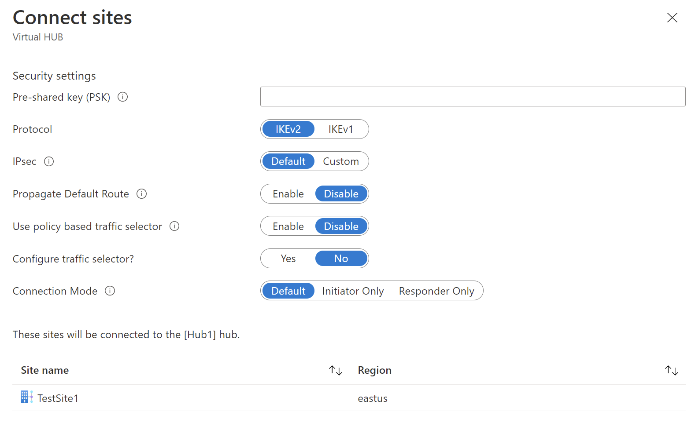

1. Select **Connect VPN Sites** to open the **Connect sites** page.

    

   Complete the following fields:

   * Enter a pre-shared key. If you don't enter a key, Azure autogenerates one for you.
   * Select the Protocol and IPsec settings. Refer to [default/custom IPSec details] (https://docs.microsoft.com/azure/virtual-wan/virtual-wan-ipsec)
   * Select the appropriate option for **Propagate Default Route**. The **Enable** option allows the virtual hub to propagate a learned default route to this connection. This flag enables default route propagation to a connection only if the default route is already learned by the Virtual WAN hub as a result of deploying a firewall in the hub, or if another connected site has forced tunneling enabled. The default route does not originate in the Virtual WAN hub.

2. Select **Connect**.
3. In a few minutes, the site will show the connection and connectivity status.

   

   **Connection Status:** This is the status of the Azure resource for the connection that connects the VPN Site to the Azure hub’s VPN gateway. Once this control plane operation is successful, Azure VPN gateway and the on-premises VPN device will proceed to establish connectivity.

   **Connectivity Status:** This is the actual connectivity (data path) status between Azure’s VPN gateway in the hub and VPN Site. It can show any of the following states:

    * **Unknown**: This state is typically seen if the backend systems are working to transition to another status.
    * **Connecting**: Azure VPN gateway is trying to reach out to the actual on-premises VPN site.
    * **Connected**: Connectivity is established between Azure VPN gateway and on-premises VPN site.
    * **Disconnected**: This status is seen if, for any reason (on-premises or in Azure), the connection was disconnected.
4. Within a hub VPN site, you can additionally do the following: 

   * Edit or delete the VPN Connection.
   * Delete the site in the Azure portal.
   * Download a branch-specific configuration for details about the Azure side using the context (…) menu next to the site. If you want to download the configuration for all connected sites in your hub, select **Download VPN Config** on the top menu.
