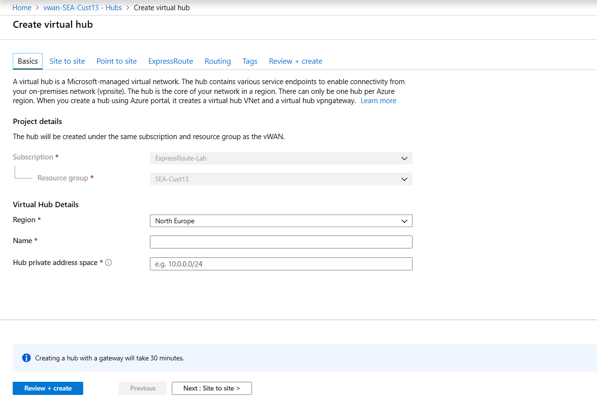
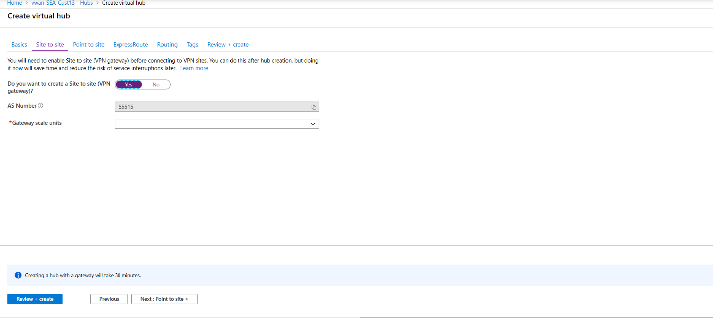

1. Locate the Virtual WAN that you created. On the Virtual WAN page, under the **Connectivity** section, select **Hubs**.
2. On the Hubs page, select **+New Hub** to open the **Create virtual hub** page.

    
3. On the **Create virtual hub** page **Basics** tab, complete the following fields:

    **Project details**

   * Region (previously referred to as Location)
   * Name
   * Hub private address space. The minimum address space is /24 to create a hub, which implies anything range from /25 to /32 will produce an error during creation. Azure Virtual WAN being a managed service by Microsoft creates the appropriate subnets in the virtual hub for the different gateways/services (e.g VPN Gateways, ExpressRoute Gateways, User VPN/Point-to-site Gateways, Firewall, Routing etc.). There is no need for the user to explicitly plan for subnet address space for the services in the Virtual Hub as Microsoft does this as a part of the service.
4. Select **Next: Site-to-site**.

    

5. On the **Site-to-site** tab, complete the following fields:

   * Select **Yes** to create a Site-to-site VPN.
   * The AS Number field is not editable in the virtual hub at this time.
   * Select the **Gateway scale units** value from the dropdown. The scale unit lets you pick the aggregate throughput of the VPN gateway being created in the virtual hub to connect sites to. If you pick 1 scale unit = 500 Mbps, it implies that two instances for redundancy will be created, each having a maximum throughput of 500 Mbps. For example, if you had five branches, each doing 10 Mbps at the branch, you will need an aggregate of 50 Mbps at the head end. Planning for aggregate capacity of the Azure VPN gateway should be done after assessing the capacity needed to support the number of branches to the hub.
6. Select **Review + Create** to validate.
7. Select **Create** to create the hub. After 30 minutes, **Refresh** to view the hub on the **Hubs** page. Select **Go to resource** to navigate to the resource.
