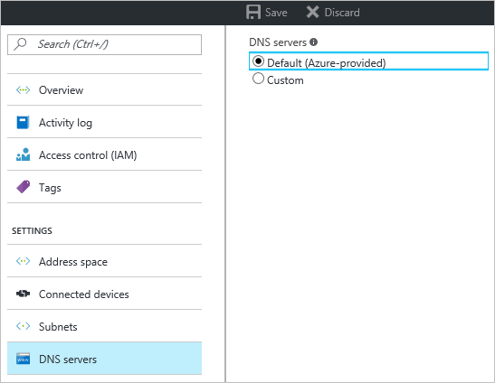

1. On the **Settings** page for your virtual network, navigate to **DNS Servers** and click to open the DNS servers blade.
2. On the **DNS Servers** page, under **DNS servers**, select **Custom**.
3. In the **DNS Server** field, in the **Add DNS server** box, enter the IP address of the DNS server that you want to use for name resolution. When you are done adding DNS servers, click **Save** at the top of the blade to save your configuration.
  