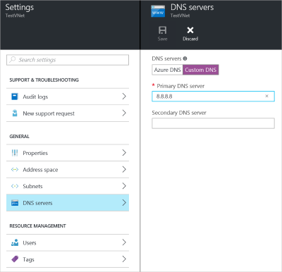

This setting allows you to specify the DNS server that you want to use for name resolution for this virtual network. It does not create a DNS server.

1. On the **Settings** page for your virtual network, navigate to **DNS Servers** and click to open the DNS servers blade.
2. On the **DNS Servers** page, under **DNS servers**, select **Custom DNS**.
3. In the **Primary DNS server** field, enter the IP address of the DNS server that you want to use for name resolution.
4. Click **Save** at the top of the blade to save your configuration.

	