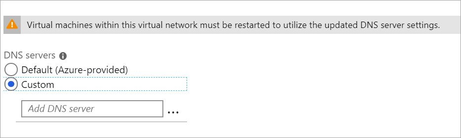

1. In the **Settings** section of your virtual network page, select **DNS servers** to open the **DNS servers** page.

    

  - **DNS servers**: Select **Custom**.
  - **Add DNS server**: Enter the IP address of the DNS server that you want to use for name resolution.

2. When you're done adding DNS servers, select **Save** at the top of the page.