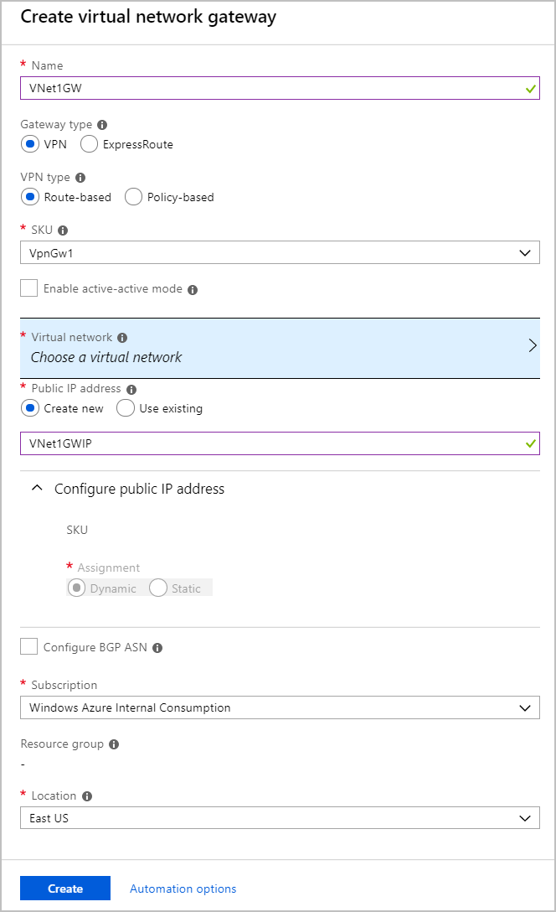

1. On the left side of the portal page, click **+** and type 'Virtual Network Gateway' in search. In **Results**, locate and click **Virtual network gateway**.
2. At the bottom of the 'Virtual network gateway' page, click **Create**. This opens the **Create virtual network gateway** page.
3. On the **Create virtual network gateway** page, specify the values for your virtual network gateway.

    

   - **Name**: Name your gateway. This is not the same as naming a gateway subnet. It's the name of the gateway object you are creating.
   - **Gateway type**: Select **VPN**. VPN gateways use the virtual network gateway type **VPN**. 
   - **VPN type**: Select the VPN type that is specified for your configuration. Most configurations require a Route-based VPN type.
   - **SKU**: Select the gateway SKU from the dropdown. The SKUs listed in the dropdown depend on the VPN type you select. For more information about gateway SKUs, see [Gateway SKUs](../articles/vpn-gateway/vpn-gateway-about-vpn-gateway-settings.md#gwsku).

     Only select **Enable active-active mode** if you are creating an active-active gateway configuration. Otherwise, leave this setting unselected.
   - **Location**: You may need to scroll to see Location. Adjust the **Location** field to point to the location where your virtual network is located. For example, West US. If the location is not pointing to the region where your virtual network resides, when you select a virtual network in the next step, it will not appear in the drop-down list.
   - **Virtual network**: Choose the virtual network to which you want to add this gateway. Click **Virtual network** to open the 'Choose a virtual network' page. Select the VNet. If you don't see your VNet, make sure the Location field is pointing to the region in which your virtual network is located.
   - **Gateway subnet address range**: You will only see this setting if you did not previously create a gateway subnet for your virtual network. If you previously created a valid gateway subnet, this setting will not appear.
   - **Public IP address**: This setting specifies the public IP address object that gets associated to the VPN gateway. The public IP address is dynamically assigned to this object when the VPN gateway is created. VPN Gateway currently only supports *Dynamic* Public IP address allocation. However, this does not mean that the IP address changes after it has been assigned to your VPN gateway. The only time the Public IP address changes is when the gateway is deleted and re-created. It doesn't change across resizing, resetting, or other internal maintenance/upgrades of your VPN gateway.

     - Leave **Create new** selected.
     - In the text box, type a **Name** for your public IP address.

4. Leave **Configure BGP ASN** deselected, unless your configuration specifically requires this setting. If you do require this setting, the default ASN is 65515, although this can be changed.
5. Verify the settings. You can select **Pin to dashboard** at the bottom of the page if you want your gateway to appear on the dashboard. 
6. Click **Create** to begin creating the VPN gateway. The settings are validated and you'll see the "Deploying Virtual network gateway" tile on the dashboard. Creating a gateway can take up to 45 minutes. You may need to refresh your portal page to see the completed status.
   gateway.

After the gateway is created, view the IP address that has been assigned to it by looking at the virtual network in the portal. The gateway appears as a connected device. You can click the connected device (your virtual network gateway) to view more information.