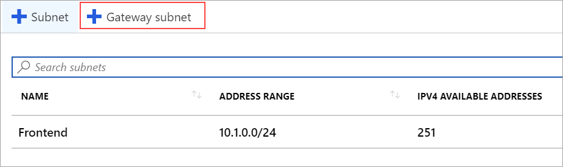

The gateway subnet contains the reserved IP addresses that the virtual network gateway services use. Create a gateway subnet.

1. In the portal, navigate to the virtual network for which you want to create a virtual network gateway.
2. On your virtual network page, click **Subnets** to expand **VNet1 - Subnets** page.
3. Click **+Gateway subnet** at the top to open the **Add subnet** page.

   
4. The **Name** for your subnet is automatically filled in with the required value 'GatewaySubnet'. Adjust the auto-filled **Address range (CIDR block)** to match the following value:

   **Address range (CIDR block)**: 10.1.255.0/27

   
5. Leave the rest of the settings as the defaults of **None** or **0 selected**. Then, click **OK** to create the gateway subnet.