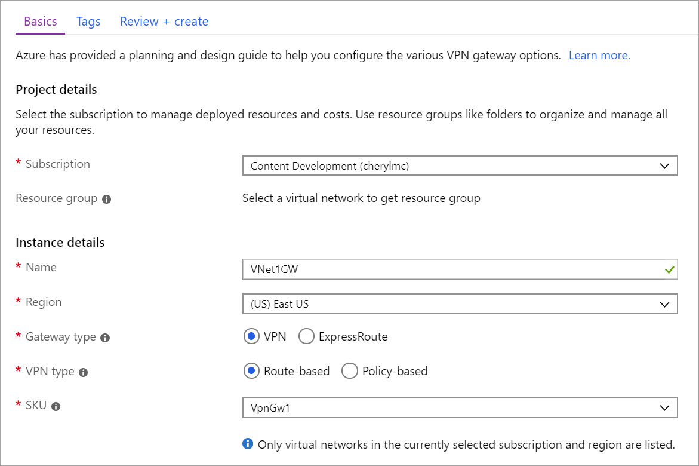

1. In the portal, on the left side, click **+** and type 'Virtual Network Gateway' in search. Locate **Virtual network gateway** in the search return and click the entry. On the **Virtual network gateway** page, click **Create** at the bottom of the page to open the **Create virtual network gateway** page.
2. On the **Create virtual network gateway** page, fill in the values for your virtual network gateway.

  
3. **Name**: Name your gateway. Naming a gateway is not the same as naming a gateway subnet. It's the name of the gateway object you are creating.
4. **Gateway type**: Select **VPN**. VPN gateways use the virtual network gateway type **VPN**.
5. **VPN type**: Select the VPN type that is specified for your configuration. Most configurations require a Route-based VPN type.
6. **SKU**: Select the gateway SKU from the dropdown. The SKUs listed in the dropdown depend on the VPN type you select.
7. **Location**: Adjust the **Location** field to point to the location where your virtual network is located. If the location is not pointing to the region where your virtual network resides, the virtual network doesn't appear in the 'Choose a virtual network' dropdown.
8. Choose the virtual network to which you want to add a gateway. Click **Virtual network** to open the **Choose a virtual network** page. Select the VNet. If you don't see your VNet, make sure the **Location** field is pointing to the region in which your virtual network is located.
9. **Public IP address**: Create a public IP address object to which a public IP address will be dynamically assigned. Click **Public IP address** to open the **Choose public IP address** page. Click **+Create New** to open the **Create public IP address page**. Input a name for your public IP address. Click **OK** to save your changes. The IP address is dynamically assigned when the VPN gateway is created. VPN Gateway currently only supports *Dynamic* Public IP address allocation. However, it doesn't mean that the IP address changes after it has been assigned to your VPN gateway. The only time the Public IP address changes is when the gateway is deleted and re-created. It doesn't change across resizing, resetting, or other internal maintenance/upgrades of your VPN gateway.
10. **Subscription**: Verify that the correct subscription is selected.
11. **Resource group**: This setting is determined by the Virtual Network that you select.
12. Don't adjust the **Location** after you've specified the previous settings.
13. Verify the settings. If you want your gateway to appear on the dashboard, you can select **Pin to dashboard** at the bottom of the page.
14. Click **Create** to begin creating the gateway. The settings are validated and the gateway deploys. Creating a gateway can take up to 45 minutes.

After the gateway is created, you can view the IP address that has been assigned to it by viewing the virtual network. The gateway appears as a connected device. You can click the connected device (your virtual network gateway) to view more information.