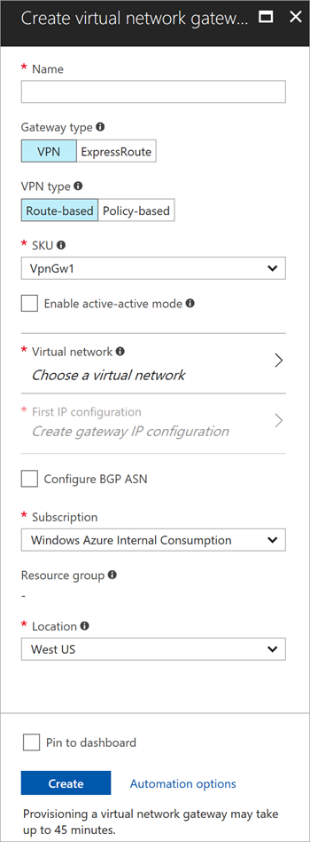

1. Sign in to the Azure portal and select **Create a resource**. The **New** page opens.

2. In the **Search the marketplace field**, enter *virtual network gateway*, and select **Virtual network gateway** from the search list. 

3. On the **Virtual network gateway** page, select **Create** to open the **Create virtual network gateway** page.

   

4. On the **Create virtual network gateway** page, fill in the values for your virtual network gateway:

   - **Name**: Enter a name for the gateway object you're creating. This name is different than the gateway subnet name. 

   - **Gateway type**: Select **VPN** for VPN gateways. 

   - **VPN type**: Select the VPN type that is specified for your configuration. Most configurations require a **Route-based** VPN type.

   - **SKU**: Select the gateway SKU from the dropdown. The SKUs listed in the dropdown depend on the VPN type you select. For more information about gateway SKUs, see [Gateway SKUs](../articles/vpn-gateway/vpn-gateway-about-vpn-gateway-settings.md#gwsku).

      Only select **Enable active-active mode** if you're creating an active-active gateway configuration. Otherwise, leave this setting unselected.
  
   - **Location**: You may need to scroll to see **Location**. Set **Location** to the location where your virtual network is located. For example, **West US**. If you don't set the location to the region where your virtual network is located, it won't appear in the drop-down list when you select a virtual network.

   - **Virtual network**: Choose the virtual network to which you want to add this gateway. Select **Virtual network** to open the **Choose virtual network** page and select the VNet. If you don't see your VNet, make sure the **Location** field is set to the region in which your virtual network is located.

   - **Gateway subnet address range**: You'll only see this setting if you didn't previously create a gateway subnet for your virtual network. If you previously created a valid gateway subnet, this setting won't appear.

   - **Public IP address**: This setting specifies the public IP address object that's associated with the VPN gateway. The public IP address is dynamically assigned to this object when the VPN gateway is created. The VPN gateway currently supports only *Dynamic* public IP address allocation. However, dynamic allocation doesn't mean that the IP address changes after it has been assigned to your VPN gateway. The only time the public IP address changes is when the gateway is deleted and re-created. It doesn't change across resizing, resetting, or other internal maintenance/upgrades of your VPN gateway.
    
      - Leave **Create new** selected.

      - In the text box, enter a name for your public IP address.

   - **Configure BGP ASN**: Leave this setting unselected, unless your configuration specifically requires it. If you do require this setting, the default ASN is *65515*, which you can change.
     
5. Verify the settings and select **Create** to begin creating the VPN gateway. The settings are validated and you'll see the **Deploying Virtual network gateway** tile on the dashboard. Creating a gateway can take up to 45 minutes. You may need to refresh your portal page to see the completed status.

6. After you create the gateway, verify the IP address that's been assigned to it by viewing the virtual network in the portal. The gateway appears as a connected device. You can select the connected device (your virtual network gateway) to view more information.