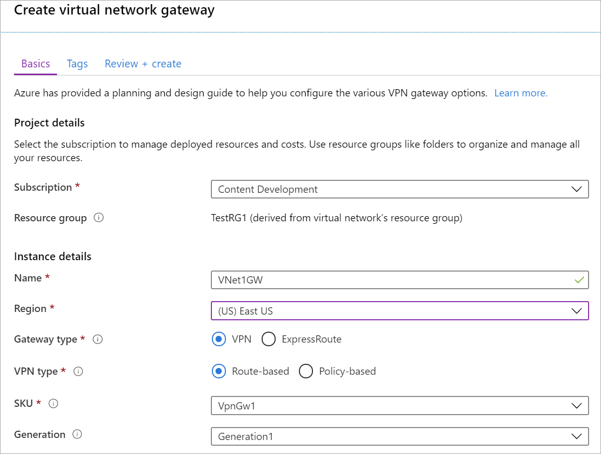
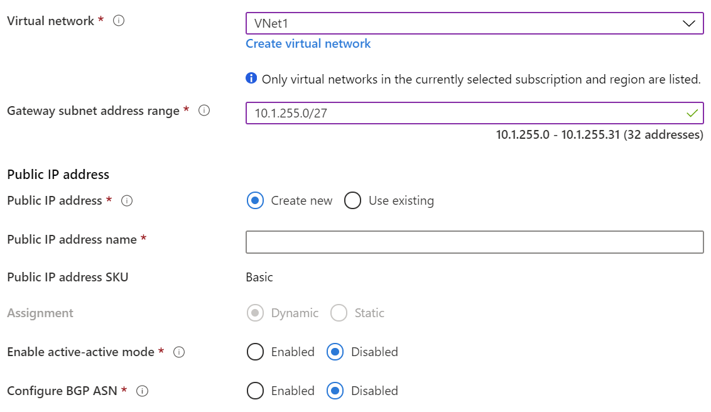

1. From the [Azure portal](https://portal.azure.com) menu, select **Create a resource**. 

   
2. In the **Search the Marketplace** field, type 'Virtual Network Gateway'. Locate **Virtual network gateway** in the search return and select the entry. On the **Virtual network gateway** page, select **Create**. This opens the **Create virtual network gateway** page.
3. On the **Basics** tab, fill in the values for your virtual network gateway.

   

   

   **Project details**

   - **Subscription**: Select the subscription you want to use from the dropdown.
   - **Resource Group**: This setting is autofilled when you select your virtual network on this page.

   **Instance details**

   - **Name**: Name your gateway. Naming your gateway not the same as naming a gateway subnet. It's the name of the gateway object you are creating.
   - **Region**: Select the region in which you want to create this resource. The region for the gateway must be the same as the virtual network.
   - **Gateway type**: Select **VPN**. VPN gateways use the virtual network gateway type **VPN**.
   - **VPN type**: Select the VPN type that is specified for your configuration. Most configurations require a Route-based VPN type.
   - **SKU**: Select the gateway SKU from the dropdown. The SKUs listed in the dropdown depend on the VPN type you select. For more information about gateway SKUs, see [Gateway SKUs](../articles/vpn-gateway/vpn-gateway-about-vpn-gateway-settings.md#gwsku).
   - **Generation**: For information about VPN Gateway Generation, see [Gateway SKUs](../articles/vpn-gateway/vpn-gateway-about-vpngateways.md#gwsku).
   - **Virtual network**: From the dropdown, select the virtual network to which you want to add this gateway.
   - **Gateway subnet address range**: This field only appears if your VNet doesn't have a gateway subnet. If possible, make the range /27 or larger (/26,/25 etc.). We don't recommend creating a range any smaller than /28. If you already have a gateway subnet, you can view GatewaySubnet details by navigating to your virtual network. Click **Subnets** to view the range. If you want to change the range, you can delete and recreate the GatewaySubnet.

   **Public IP address**: This setting specifies the public IP address object that gets associated to the VPN gateway. The public IP address is dynamically assigned to this object when the VPN gateway is created. The only time the Public IP address changes is when the gateway is deleted and re-created. It doesn't change across resizing, resetting, or other internal maintenance/upgrades of your VPN gateway.

     - **Public IP address**: Leave **Create new** selected.
     - **Public IP address name**: In the text box, type a name for your public IP address instance.
     - **Assignment**: VPN gateway supports only Dynamic.

   **Active-Active mode**: Only select **Enable active-active mode** if you are creating an active-active gateway configuration. Otherwise, leave this setting unselected.

   Leave **Configure BGP ASN** deselected, unless your configuration specifically requires this setting. If you do require this setting, the default ASN is 65515, although this can be changed.
4. Select **Review + create** to run validation. Once validation passes, select **Create** to deploy the VPN gateway. A gateway can take up to 45 minutes to fully create and deploy. You can see the deployment status on the Overview page for your gateway.

After the gateway is created, you can view the IP address that has been assigned to it by looking at the virtual network in the portal. The gateway appears as a connected device.
