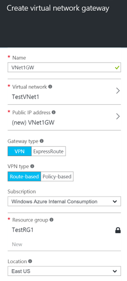
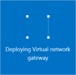

1. In the portal, go to **New**, then **Networking**. Select **Virtual network gateway** from the list.

	

2. On the **Create virtual network gateway** blade **Name** field, name your gateway. This is not the same as naming a gateway subnet. It's the name of the gateway object.
 
3. Next, choose the virtual network that you want to deploy this gateway to. Click the arrow to open the **Choose a virtual network** blade, and then click the VNet. In order for the VNet to appear in the list, it must already have a valid gateway subnet.

4. Choose a public IP address. Click the arrow to open the **Choose public IP address blade**. Then click **Create New** to open the **Create public IP address blade**. Input a name your public IP address. Note that this is not asking for an IP address. The IP address will be assigned dynamically. Rather, this is the name of the IP address object that the address will be assigned to. Click **OK** to save your changes.

5. For **Gateway type**, select the Gateway type that is specified for your configuration.

6. For **VPN type**, select the VPN type that is specified for your configuration.

7. For **Subscription**, verify that the correct subscription is selected.

8. For **Resource Group**, the resource group is determined by the Virtual Network that you select.

9. For **Location**, make sure it's showing the location that both your Resource Group and VNet exist in.

10. You can select **Pin to dashboard** if you want your gateway to appear on the dashboard. Click **Create** to begin creating the gateway. You'll see the "Deploying Virtual network gateway" tile on the dashboard. Creating a gateway can take up to 45 minutes. There is a lot going on in the background. You may need to refresh your portal page to see the completed status.

	
	

11. After the gateway is created, you can view the IP address that has been assigned to it by looking at the virtual network in the portal. The gateway will appear as a connected device. You can click on the connected device (your virtual network gateway) to view more information.

