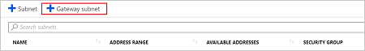
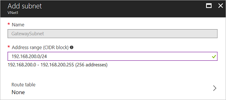

1. In the [portal](https://portal.azure.com), navigate to the Resource Manager virtual network for which you want to create a virtual network gateway.
2. In the **Settings** section of your VNet page, click **Subnets** to expand the **Subnets** page.
3. On the **Subnets** page, click **+Gateway subnet** to open the **Add subnet** page. 

   
4. The **Name** for your subnet is automatically filled in with the value 'GatewaySubnet'. This value is required in order for Azure to recognize the subnet as the gateway subnet. Adjust the auto-filled **Address range** values to match your configuration requirements. Don't configure Route table or Service endpoints.

   
5. Click **OK** at the bottom of the page to create the subnet.
