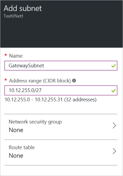

1. In the portal, navigate to the virtual network to which you want to connect a gateway. On the blade for your virtual network, click the **Settings** icon at the top of the blade to expand the Setting blade. 

2. On the **Settings** blade, click **Subnets** to expand the Subnets blade.

3. On the **Subnets** blade, click **Add** to expand the **Add subnet** blade.

	

4. On the **Add subnet** blade, name your subnet **GatewaySubnet**. You should not name it anything else, or the gateway will not work.

5. Add the IP **address range** for your gateway.

6. Click **OK** at the bottom of the blade to create the subnet.

