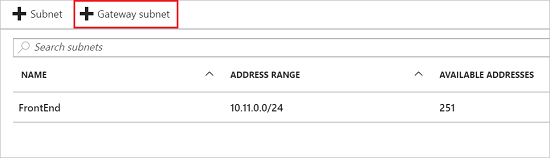
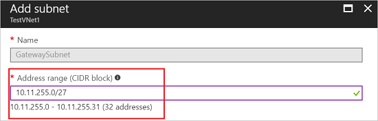

1. In the portal, navigate to the virtual network for which you want to create a virtual network gateway.
2. In the **Settings** section of your VNet blade, click **Subnets** to expand the Subnets blade.
3. On the **Subnets** blade, click **+Gateway subnet** at the top. This will open the **Add subnet** blade.

  
4. The **Name** for your subnet will automatically be filled in with the value 'GatewaySubnet'. This value is required in order for Azure to recognize the subnet as the GatewaySubnet. Adjust the auto-filled **Address range** values to match your configuration requirements.

  
5. Click **OK** at the bottom of the blade to create the subnet.