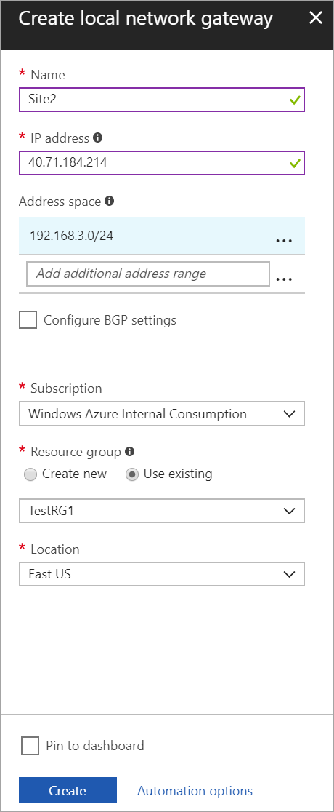

1. In the portal, from **All resources**, click **+Add**. 
2. In the **Everything** blade search box, type **Local network gateway**, then click to search. This will return a list. Click **Local network gateway** to open the blade, then click **Create** to open the **Create local network gateway** blade.

  

3. On the **Create local network gateway blade**, specify the values for your local network gateway.

  - **Name:** Specify a name for your local network gateway object.
  - **IP address:** This is the public IP address of the VPN device that you want Azure to connect to. Specify a valid public IP address. The IP address cannot be behind NAT and has to be reachable by Azure. If you don't have the IP address right now, you can use the values shown in the screen shot, but you'll need to go back and replace your placeholder IP address with the public IP address of your VPN device. Otherwise, Azure will not be able to connect.
  - **Address Space** refers to the address ranges for the network that this local network represents. You can add multiple address space ranges. Make sure that the ranges you specify here do not overlap with ranges of other networks that you want to connect to. Azure will route the address range that you specify to the on-premises VPN device IP address. *Use your own values here, not the values shown in the screenshot*.
  - **Subscription:** Verify that the correct subscription is showing.
  - **Resource Group:** Select the resource group that you want to use. You can either create a new resource group, or select one that you have already created.
  - **Location:** Select the location that this object will be created in. You may want to select the same location that your VNet resides in, but you are not required to do so.

4. When you have finished specifying the values, click **Create** at the bottom of the blade to create the local network gateway.