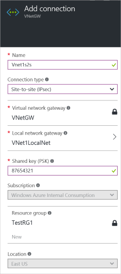
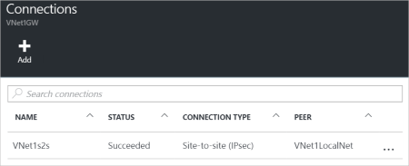

1. Locate your virtual network gateway and click **All settings** to open the **Settings** blade.

2. On the **Settings** blade, click **Connections**, and then click **Add** at the top of the blade to open the **Add connection** blade.

	

3. On the **Add connection** blade, **Name** your connection. 

4. For **Connection type**, select **Site-to-site(IPSec)**.

5. For **Virtual network gateway**, the value is fixed because you are connecting from this gateway.

6. For **Local network gateway**, click **Choose a local network gateway** and select the local network gateway that you want to use. 

7. For **Shared Key**, the value here must match the value that you are using for your local VPN device. If your VPN device on your local network doesn't provide a shared key, you can make one up and input it here and on your local device. The important thing is that they both match.

8. The remaining values for **Subscription**, **Resource Group**, and **Location** are fixed.

9. Click **OK** to create your connection. You'll see *Creating Connection* flash on the screen.

10. When the connection is complete, you'll see it appear in the **Connections** blade for your Gateway.

	

