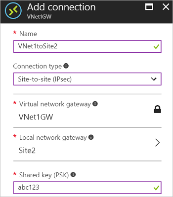

1. Navigate to and open the blade for your virtual network gateway. There are multiple ways to navigate. In our example, we navigated to the gateway 'VNet1GW' by going to **TestVNet1 -> Overview -> Connected devices -> VNet1GW**.
2. On the blade for VNet1GW, click **Connections**. At the top of the Connections blade, click **+Add** to open the **Add connection** blade.

    

3. On the **Add connection** blade, fill in the values to create your connection.

  - **Name:** Name your connection. We use **VNet1toSite2** in our example.
  - **Connection type:** Select **Site-to-site(IPSec)**.
  - **Virtual network gateway:** The value is fixed because you are connecting from this gateway.
  - **Local network gateway:** Click **Choose a local network gateway** and select the local network gateway that you want to use. In our example, we use **Site2**.
  - **Shared Key:** the value here must match the value that you are using for your local on-premises VPN device. In the example, we used 'abc123', but you can (and should) use something more complex. The important thing is that the value you specify here must be the same value that you specified when configuring your VPN device.
  - The remaining values for **Subscription**, **Resource Group**, and **Location** are fixed.

4. Click **OK** to create your connection. You'll see *Creating Connection* flash on the screen.
5. You can view the connection in the **Connections** blade of the virtual network gateway. The Status will go from *Unknown* to *Connecting*, and then to *Succeeded*.