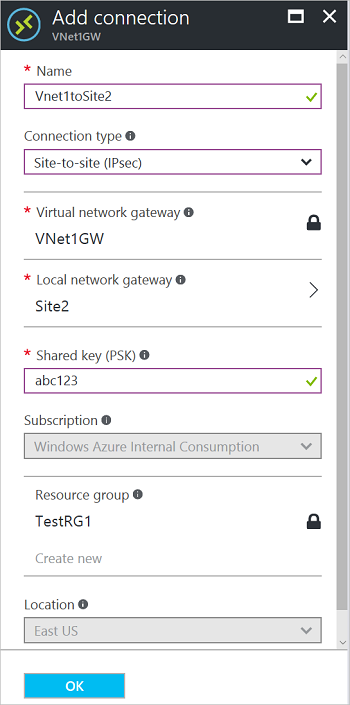
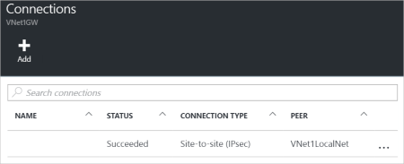

1. Locate your virtual network gateway.
2. Click **Connections**. At the top of the Connections blade, click **+Add** to open the **Add connection** blade.
   
    
3. On the **Add connection** blade, **Name** your connection. 
4. For **Connection type**, select **Site-to-site(IPSec)**.
5. For **Virtual network gateway**, the value is fixed because you are connecting from this gateway.
6. For **Local network gateway**, click **Choose a local network gateway** and select the local network gateway that you want to use. 
7. For **Shared Key**, the value here must match the value that you are using for your local on-premises VPN device. In the example, we used 'abc123', but you can (and should) use something more complex. The important thing is that the value you specify here must be the same value that you specified when configuring your VPN device.
8. The remaining values for **Subscription**, **Resource Group**, and **Location** are fixed.
9. Click **OK** to create your connection. You'll see *Creating Connection* flash on the screen.
10. When the connection is complete, it appears in the **Connections** blade of the virtual network gateway.
    
    

