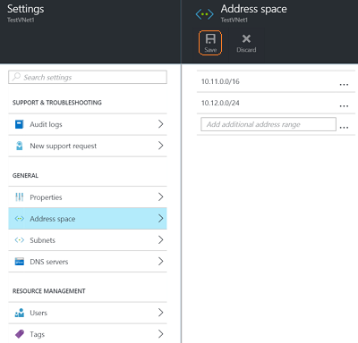

### To add address space

1. To add additional address space, click **All settings** to open the **Settings** blade. 

2. On the **Settings** blade, click **Address space** to open the Address space blade. Add the additional address space in this blade, and then click **Save** at the top of the blade.

	

### To add subnets 

1. To add additional subnets to your address spaces, in the **Settings** blade, click **Subnets** to open the **Subnets** blade. 

2. In the Subnets blade, click **Add** to open the **Add subnet** blade. Name your new subnet and specify the address range, and then click **OK** at the bottom of the blade. Once a subnet has been created, you can use the subnets blade to view all of your subnets for a VNet.

			
