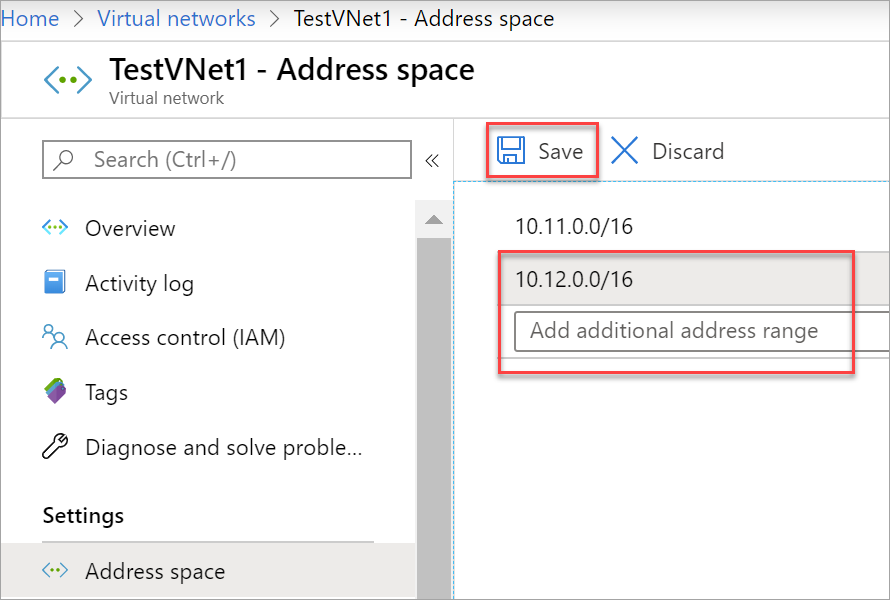
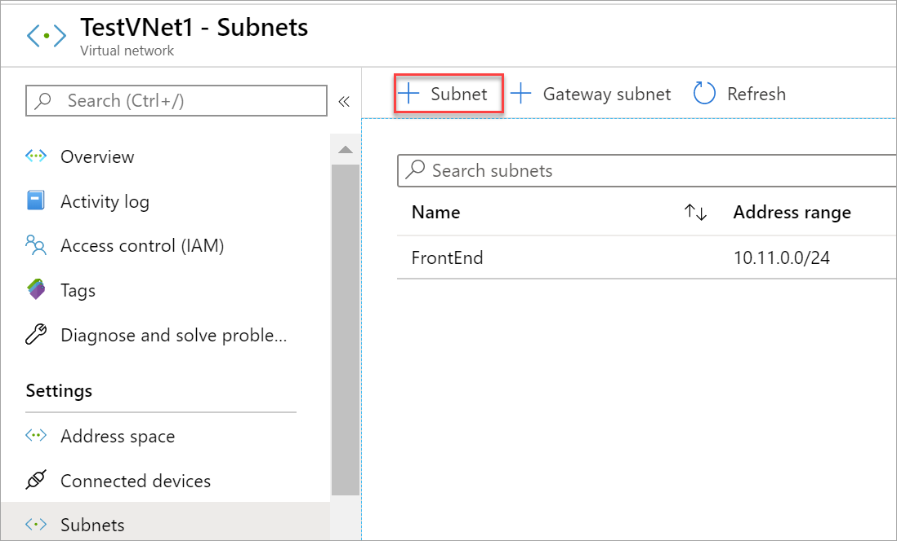
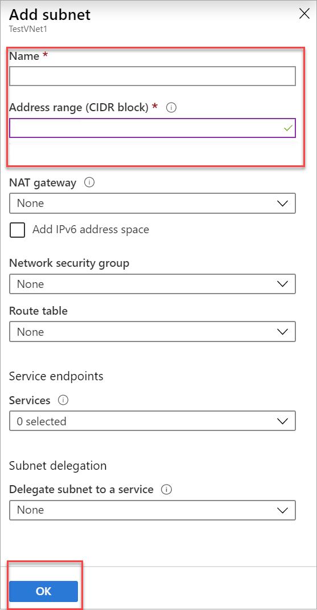

### To add additional address space

1. To add additional address ranges to your address space, in the **Settings** section of your virtual network page, select **Address space**. The **Address space** page appears.
2. Add the additional address range, and then select **Save** at the top of the page.

   

### To create additional subnets

1. To create additional subnets, in the **Settings** section of your virtual network page, select **Subnets**. The **Subnets** page appears.
1. Select **+ Subnet** to open the **Add subnet** page.

   
1. Enter the **Name** of your new subnet and specify the **Address range**. To save your changes, select **OK** at the bottom of the page.

   
