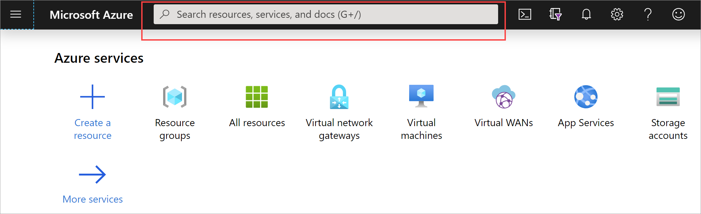
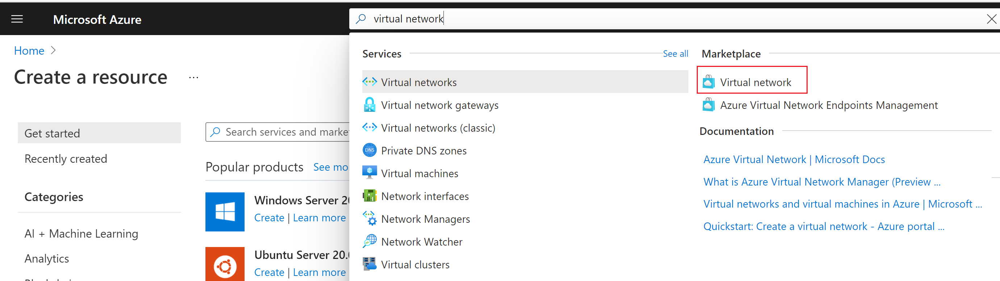
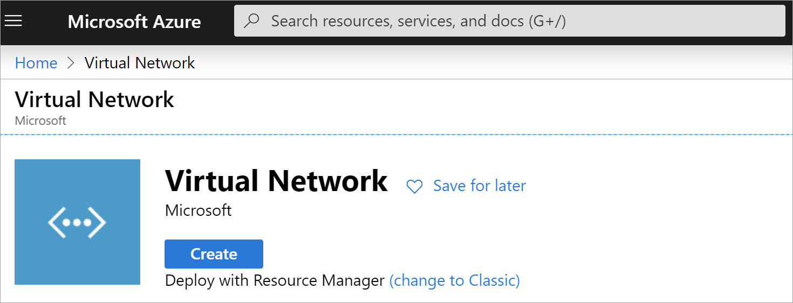
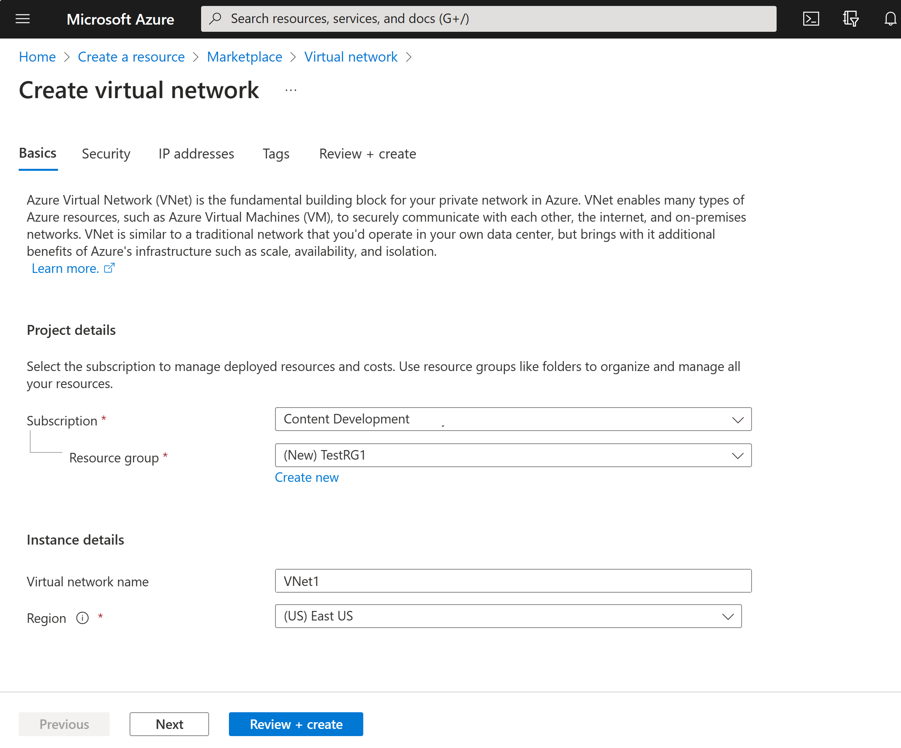

You can create a VNet with the Resource Manager deployment model and the Azure portal by following these steps. For more information about virtual networks, see [Virtual Network overview](../articles/virtual-network/virtual-networks-overview.md).

>[!NOTE]
>When using a virtual network as part of a cross-premises architecture, be sure to coordinate with your on-premises network administrator to carve out an IP address range that you can use specifically for this virtual network. If a duplicate address range exists on both sides of the VPN connection, traffic will route in an unexpected way. Additionally, if you want to connect this virtual network to another virtual network, the address space cannot overlap with the other virtual network. Plan your network configuration accordingly.
>
>

1. Sign in to the [Azure portal](https://portal.azure.com).
1. In **Search resources, service, and docs (G+/)**, type *virtual network*.

   
1. Select **Virtual Network** from the **Marketplace** results.

   
1. On the **Virtual Network** page, select **Create**.

   
1. Once you select **Create**, the **Create virtual network** page opens.
1. On the **Basics** tab, configure **Project details** and **Instance details** VNet settings.

    When you fill in the fields, you see a green check mark when the characters you enter in the field are validated. Some values are autofilled, which you can replace with your own values:

   - **Subscription**: Verify that the subscription listed is the correct one. You can change subscriptions by using the drop-down.
   - **Resource group**: Select an existing resource group, or click **Create new** to create a new one. For more information about resource groups, see [Azure Resource Manager overview](../articles/azure-resource-manager/management/overview.md#resource-groups).
   - **Name**: Enter the name for your virtual network.
   - **Region**: Select the location for your VNet. The location determines where the resources that you deploy to this VNet will live.

1. On the **IP Addresses** tab, configure the values. The values shown in the examples below are for demonstration purposes. Adjust these values according to the settings that you require.

     
   - **IPv4 address space**: By default, an address space is automatically created. You can click the address space to adjust it to reflect your own values. You can also add additional address spaces.
   - **IPv6**: If your configuration requires IPv6 address space, select the **Add IPv6 address space** box to enter that information.
   - **Subnet**: If you use the default address space, a default subnet is created automatically. If you change the address space, you need to add a subnet. Select **+ Add subnet** to open the **Add subnet** window. Configure the following settings and then select **Add** to add the values:
      - **Subnet name**: In this example, we named the subnet "FrontEnd".
      - **Subnet address range**: The address range for this subnet.

1. On the **Security** tab, at this time, leave the default values:

   - **DDos protection**: Basic
   - **Firewall**: Disabled
1. Select **Review + create** to validate the virtual network settings.
1. After the settings have been validated, select **Create**.
