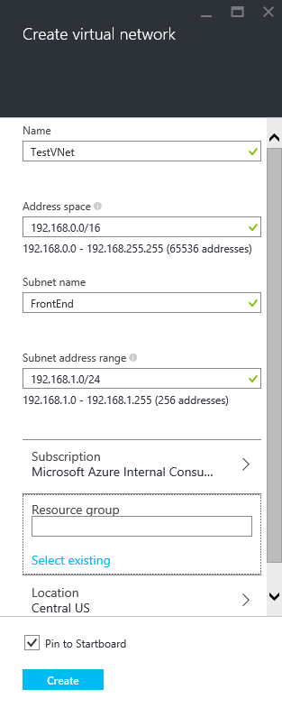

To create a VNet based on the scenario above by using the Azure portal, follow the steps below. If are doing these steps as an exercise, be sure to replace the values with those that are specified for this article. The values below don't necessarily match the steps for this exercise. For more information about working with virtual networks, see the [Virtual Network Overview](../articles/virtual-network/virtual-networks-overview.md).

1. From a browser, navigate to the [Azure Portal](http://portal.azure.com) and, if necessary, sign in with your Azure account.

2. Click **New** **>** **Networking** **>** **Virtual network**. 

3. Near the bottom of the Virtual Network blade, from the **Select a deployment model** list, select **Resource Manager** and then click **Create**.

4. On the **Create virtual network** blade, configure the VNet settings. In this blade, you'll add your first address space and a single subnet address range. After you finish creating the VNet, you can go back and add additional subnets and address spaces. This is a current limitation of the portal. The values that you use will depend on the configuration you want to create. Be sure to refer to your planned configuration values. 

	

5. Click **Resource group** and select a resource group to which you want to associate your new VNet. If you want to create a new resource group, select **Create new**. Name the resource group according to your planned configuration values. For more information about resource groups, visit [Azure Resource Manager Overview](resource-group-overview.md/#resource-groups).

	

6. Next, select the **Subscription** and **Location** settings for your VNet. Note that the location will determine where the resources that you deploy to this VNet will reside. You can't change this later without redeploying your resources.

7. Click **Create** and notice the tile named **Creating Virtual network** as shown in the figure below.

	

8. Once your VNet has been created, you can make changes to it such as adding additional address space, subnets, and DNS servers.

## Add additional address space and subnets to your VNet

1. To add additional address space to your VNet, in the blade for your VNet, click **Settings** to open the Settings blade. Then click **Address space** to open the Address space blade. Add the additional address space in this blade, and then click **Save** at the top of the blade.

2. To add additional subnets to your address spaces, in the **Settings** blade, click **Subnets** to open the Subnets blade. In the Subnets blade, click **Add** to open the **Add subnet** blade. Name your new subnet and specify the address range, and then click **OK** at the bottom of the blade.

	

3. To view the list of subnets:

	
