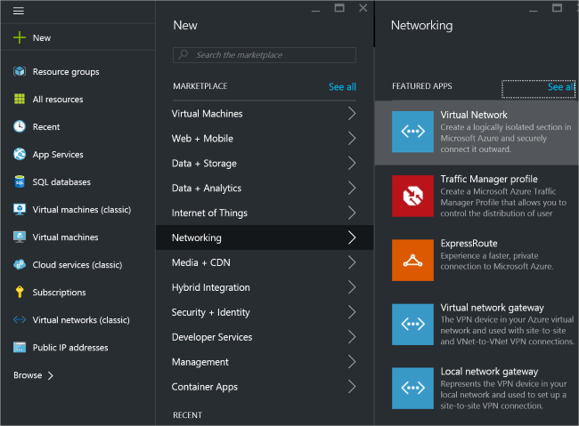
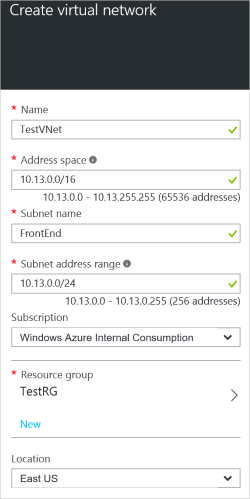
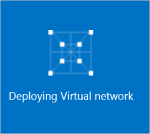

To create a VNet by using the Azure portal, follow the steps below. Note that the screenshots are provided as examples. Be sure to replace the values with your own. For more information about working with virtual networks, see the [Virtual Network Overview](../articles/virtual-network/virtual-networks-overview.md).

1. From a browser, navigate to the [Azure portal](http://portal.azure.com) and, if necessary, sign in with your Azure account.

2. Click **New** **>** **Networking** **>** **Virtual Network**.

	

3. Near the bottom of the Virtual Network blade, from the **Select a deployment model** list, select **Resource Manager**, and then click **Create**.

	

4. On the **Create virtual network** blade, configure the VNet settings. In this blade, you'll add your first address space and a single subnet address range. After you finish creating the VNet, you can go back and add additional subnets and address spaces. This is a current limitation of the portal. You can always come back to update these values by editing the VNet properties in the portal, or by using PowerShell. The values that you use will depend on the configuration you want to create. Be sure to refer to your planned configuration values. 

	

5. Verify that the **Subscription** is the correct one. You can change subscriptions by using the dropdown.

6. Click **Resource group** and either select an existing resource group, or create a new one by typing a name for your new resource group. If you are creating a new group, name the resource group according to your planned configuration values. For more information about resource groups, visit [Azure Resource Manager Overview](resource-group-overview.md#resource-groups).

7. Next, select the **Location** settings for your VNet. Note that the location will determine where the resources that you deploy to this VNet will reside. You can't change this later without redeploying your resources.

8. Select **Pin to dashboard** if you want to be able to find your VNet easily on the dashboard, and then click **Create**.
	
	

9. After clicking Create, you will see a tile on your dashboard that will reflect the progress of your VNet. The tile will change as the VNet is being created.

	