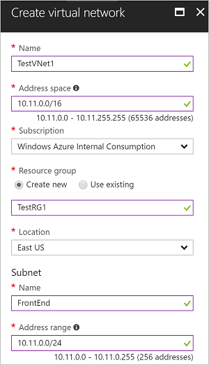

To create a VNet in the Resource Manager deployment model by using the Azure portal, follow the steps below. The screenshots are provided as examples. Be sure to replace the values with your own. For more information about working with virtual networks, see the [Virtual Network Overview](../articles/virtual-network/virtual-networks-overview.md).

1. From a browser, navigate to the [Azure portal](http://portal.azure.com) and sign in with your Azure account.
2. Click **New**. In the **Search the marketplace** field, type 'Virtual Network'. Locate **Virtual Network** from the returned list and click to open the **Virtual Network** blade.
3. Near the bottom of the Virtual Network blade, from the **Select a deployment model** list, select **Resource Manager**, and then click **Create**.
4. On the **Create virtual network** blade, configure the VNet settings. When you fill in the fields, the red exclamation mark will become a green check mark when the characters entered in the field are valid.
5. The **Create virtual network** blade looks similar to the following example. There may be values that are auto-filled. If so, replace the values with your own.
   
    
6. **Name**: Enter the name for your Virtual Network.
7. **Address space**: Enter the address space. If you have multiple address spaces to add, add your first address space. You can add additional address spaces later, after creating the VNet. Make sure that the address space that you specify does not overlap with the address space for your on-premises location.
8. **Subnet name**: Add the subnet name and subnet address range. You can add additional subnets later, after creating the VNet.
9. **Subscription**: Verify that the Subscription listed is the correct one. You can change subscriptions by using the drop-down.
10. **Resource group**: Select an existing resource group, or create a new one by typing a name for your new resource group. If you are creating a new group, name the resource group according to your planned configuration values. For more information about resource groups, visit [Azure Resource Manager Overview](../articles/azure-resource-manager/resource-group-overview.md#resource-groups).
11. **Location**: Select the location for your VNet. The location determines where the resources that you deploy to this VNet will reside.
12. Select **Pin to dashboard** if you want to be able to find your VNet easily on the dashboard, and then click **Create**.
13. After clicking **Create**, you will see a tile on your dashboard that will reflect the progress of your VNet. The tile changes as the VNet is being created.