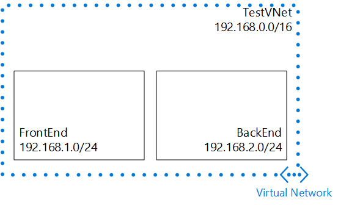

In this scenario, you'll create a VNet named **TestVNet** with a reserved CIDR block of **192.168.0.0./16**. Your VNet will contain the following subnets:

- **FrontEnd**, using **192.168.1.0/24** as its CIDR block.
- **BackEnd**, using **192.168.2.0/24** as its CIDR block.

